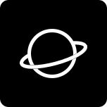

<p align="center">
  
</p>

<h1 align="center">Saturn</h1>

<p align="center">
  A modern, lightweight, GPU-accelerated desktop UI framework for Python.
</p>

<p align="center">
  
  
  
</p>

> **Saturn** is currently in **alpha** stages. Everything may change, some controls are still being completed, and production use should be evaluated carefully.

Saturn provides a familiar, declarative API for building native desktop interfaces while keeping rendering and the event loop local to the application.

Browse the [Saturn documentation](./docs/README.md) for API pages and a screenshot gallery.

Material 3 Expressive controls are grouped under `saturn.Compose`; see the [Compose API and Flet verification](./docs/compose.md).

Inspired by the simplicity of [Flet](https://flet.dev/), Saturn takes a **lighter and more local approach** to desktop UI development. It uses almost the same concepts and API patterns, while remaining an independent, minimal, and lightweight native UI framework with its own architecture and direction.

Saturn implements a subset of Flet-style desktop APIs. When migrating a Flet application, check constructor parameters and behavior against the [Flet mapping](./docs/flet-mapping.md) and [verified API gaps](./docs/compose.md).

If you're looking to build a **web application**, [use Flet instead](https://flet.dev/).

## Third-party expressive geometry

The generated loading shapes in `saturn/_gen/loading_shapes.json` derive from AndroidX Compose Material 3 and Graphics Shapes. Their source files carry Android Open Source Project copyright notices; Saturn transformed the geometry into matching Bézier curves using JetBrains Compose Material 3 desktop and AndroidX Graphics Shapes. The derived geometry is distributed under Apache License 2.0. See the [source attribution and exact versions](./saturn/_gen/NOTICE.md) and the [full license text](./saturn/_gen/LICENSE-APACHE-2.0.txt).

## Preview

<table>
  <tr>
    <td align="center">
      <strong>Demo</strong><br>
      
    </td>
    <td align="center">
      <strong>Layout</strong><br>
      
    </td>
  </tr>
  <tr>
    <td align="center">
      <strong>Text</strong><br>
      
    </td>
    <td align="center">
      <strong>Widgets</strong><br>
      
    </td>
  </tr>
  <tr>
    <td align="center">
      <strong>Buttons</strong><br>
      
    </td>
    <td align="center">
      <strong>Inputs</strong><br>
      
    </td>
  </tr>
  <tr>
    <td align="center">
      <strong>Expressive</strong><br>
      
    </td>
    <td align="center">
      <strong>Demo</strong><br>
      
    </td>
  </tr>
  <tr>
    <td align="center">
      <strong>Motion</strong><br>
      
    </td>
    <td align="center">
      <strong>FAB Menu</strong><br>
      
    </td>
  </tr>
</table>

<p align="center">
  <i>Preview: not final.</i>
</p>

## Why

Saturn is built around a simple idea: **desktop UI development should be lightweight, easy to understand, and easy to extend.**

The API and architecture are intentionally kept **extremely simple, lightweight, and extensible**, with a focus on local rendering and a clear separation between the framework and the language it is implemented in.

Saturn takes inspiration from familiar declarative UI frameworks such as [Flet](https://flet.dev/), while developing its own approach to native desktop UI. By keeping the design language simple and implementation-independent, the same concepts can be brought to other programming languages in the future.

Unlike frameworks built around **Skia or WebView**, Saturn renders directly through the platform's **native graphics APIs**, avoiding unnecessary rendering layers and keeping the rendering pipeline lightweight and efficient.

That's our goal: **a small foundation that is easy to understand, extend, and port.**

## Requirements

- Python 3.10 or newer
- A desktop environment supported by SDL
- An OpenGL-capable driver when using the OpenGL backend

Saturn is still in its early stages and is currently developed and tested exclusively on Windows. Cross-platform support is planned for future releases as the project matures.

## Installation

Clone the repository and install its dependencies with [uv](https://docs.astral.sh/uv/):

```bash
git clone https://github.com/the-OmegaLabs/Saturn.git
cd Saturn
uv sync
```

Alternatively, install the project into an existing virtual environment:

```bash
python -m pip install -e .
```

## Quick start

```python
import saturn


def main(page: saturn.Page):
    page.title = "Hello Saturn"
    page.theme_mode = saturn.ThemeMode.DARK
    page.bgcolor = saturn.Colors.SURFACE
    page.padding = 24

    message = saturn.Text(
        "Hello from Saturn!",
        size=28,
        weight=saturn.FontWeight.BOLD,
        color=saturn.Colors.ON_SURFACE,
    )

    def handle_click(e):
        message.value = "It works!"
        message.update()

    page.add(
        message,
        saturn.FilledButton(
            "Click me",
            icon=saturn.Icons.AUTO_AWESOME,
            on_click=handle_click,
        ),
    )
    page.update()


saturn.run(main)
```
Controls are mutable. After changing a control's state, call `control.update()` or `page.update()` to schedule a redraw.

Or run the bundled hello example:

```bash
uv run python examples/hello.py
```

The API is intentionally simple and familiar, so writing Saturn applications feels almost the same as writing Flet applications.

## Rendering backends

OpenGL is the default renderer for `saturn.run(main)`. Select another renderer explicitly when needed:

```python
# CPU renderer
saturn.run(main, backend=saturn.Renderer.SOFTWARE)

# Explicit GPU renderer
saturn.run(main, backend=saturn.Renderer.OPENGL)

# Vulkan GPU renderer
saturn.run(main, backend=saturn.Renderer.VULKAN)
```

The Vulkan backend draws geometry and composites textures on the GPU with batched draw calls and scissor clipping. Text and some effects are prepared as surfaces before texture upload; the full frame is not rasterized on the CPU. A Vulkan-capable driver is required. The backend can also be selected with the `SATURN_BACKEND` environment variable when `backend` is omitted:

```powershell
$env:SATURN_BACKEND = "opengl"
uv run python examples/hello.py
```

## Implemented or partially implemented

| Category | Available controls |
|---|---|
| Layout | `Row`, `Column`, `Stack`, `Container`, `Card`, `Divider`, `ListView` |
| Content | `Text`, `Icon`, `Image` |
| Buttons | `Button`, `ElevatedButton`, `FilledButton`, `FilledTonalButton`, `OutlinedButton`, `TextButton`, `IconButton` |
| Inputs | `TextField`, `Checkbox`, `Switch`, `Radio`, `RadioGroup`, `Slider`, `Dropdown` |
| Feedback | `ProgressBar`, `ProgressRing`, `AlertDialog`, `SnackBar` |
| Interaction | `GestureDetector`, tooltips, pointer and keyboard events |
| Services | `FilePicker` |

The public API also includes theme, alignment, padding, border, shadow, animation, transform, text-style, and scrolling types.

## Custom fonts

Register local `.ttf`, `.otf`, or `.woff2` files with `page.fonts`, then use the alias in a theme or individual control:

```python
from pathlib import Path
import saturn as ft

font = Path(__file__).parent / "assets" / "Brand.woff2"

def main(page: ft.Page):
    page.fonts = {"brand": str(font)}
    page.theme = ft.Theme(font_family="brand")
    page.add(ft.Text("Hello Saturn", font_family="brand", size=24))

ft.run(main)
```

WOFF2 is decoded on first use and cached as a native font. Variable WOFF2 fonts use the existing weight selection and glyph fallback paths. A local font file path can also be passed directly as `font_family`.

The bundled Inter and Noto Sans SC families ship as WOFF2. The Chinese fallback is decoded only when a character needs it; common regular and bold weights retain their prebuilt instances.

## Examples

| Example | Description |
|---|---|
| [`examples/hello.py`](./examples/hello.py) | Minimal application and window lifecycle |
| [`examples/demo.py`](./examples/demo.py) | Combined control showcase |
| [`examples/layout_demo.py`](./examples/layout_demo.py) | Layout, alignment, expansion, and stacking |
| [`examples/inputs_demo.py`](./examples/inputs_demo.py) | Text fields, toggles, radios, sliders, and dropdowns |
| [`examples/buttons_demo.py`](./examples/buttons_demo.py) | Button variants and events |
| [`examples/text_demo.py`](./examples/text_demo.py) | Typography and text behavior |
| [`examples/widgets_demo.py`](./examples/widgets_demo.py) | Icons, images, cards, and progress indicators |
| [`examples/expressive_demo.py`](./examples/expressive_demo.py) | Expressive controls in light and dark themes |
| [`examples/expressive_motion_demo.py`](./examples/expressive_motion_demo.py) | Loading shapes, waves, toolbar, and FAB menu |

Run the full showcase with either renderer:

```bash
uv run python examples/demo.py
uv run python examples/demo.py --backend opengl
```

## Contributing

**Saturn** is an open-source project led by **Omega Labs**. Contributions, issues, and feature requests are welcome.

## License

License information will be announced later.
