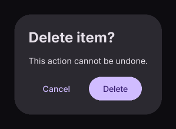

# AlertDialog

Displays a modal dialog on the page.

[← API index](./README.md)

Source: [`saturn/widgets/dialogs.py`](../../saturn/widgets/dialogs.py) (line 71).

## Preview



## Example

Run this code from the repository root to display the control shown above.

```python
import saturn


def main(page: saturn.Page):
    page.window.width = 720
    page.window.height = 360
    page.theme_mode = saturn.ThemeMode.DARK
    page.bgcolor = saturn.Colors.SURFACE
    page.padding = 40
    page.show_dialog(saturn.AlertDialog(title="Delete item?", content=saturn.Text("This action cannot be undone."), actions=[saturn.TextButton("Cancel"), saturn.FilledButton("Delete")]))
    page.update()


saturn.run(main, backend=saturn.Renderer.SOFTWARE)
```

**Base class:** `DialogControl`

## Constructor parameters

```python
saturn.AlertDialog(title=None, content=None, *, actions=None, modal=False, bgcolor=None, open=False, on_dismiss=None, elevation=None, icon=None, title_padding=None, content_padding=None, actions_padding=None, actions_alignment=None, shape=None, inset_padding=None, icon_padding=None, action_button_padding=None, shadow_color=None, icon_color=None, scrollable=False, actions_overflow_button_spacing=None, alignment=None, content_text_style=None, title_text_style=None, clip_behavior='none', semantics_label=None, barrier_color=None, **base)
```

| Parameter | Type annotation | Default | Description |
| --- | --- | --- | --- |
| `title` | `—` | `None` | Title of a dialog, notification, or window. |
| `content` | `—` | `None` | Text or child control to display. |
| `actions` | `—` | `None` | Action buttons at the bottom of a dialog. |
| `modal` | `—` | `False` | Prevent closing the dialog by clicking its barrier when True. |
| `bgcolor` | `—` | `None` | Background color of the control or container. |
| `open` | `—` | `False` | Whether the dialog or snackbar is open. |
| `on_dismiss` | `—` | `None` | Callback called when the dialog or snackbar closes. |
| `elevation` | `—` | `None` | Surface elevation, which determines shadow strength. |
| `icon` | `—` | `None` | Icon to draw. |
| `title_padding` | `—` | `None` | Insets around title. |
| `content_padding` | `—` | `None` | Insets around content. |
| `actions_padding` | `—` | `None` | Insets around actions. |
| `actions_alignment` | `—` | `None` | Main-axis arrangement of dialog action controls. |
| `shape` | `—` | `None` | Base shape of the button. |
| `inset_padding` | `—` | `None` | Insets around inset. |
| `icon_padding` | `—` | `None` | Insets around icon. |
| `action_button_padding` | `—` | `None` | Insets around action button. |
| `shadow_color` | `—` | `None` | Unsupported for non-default requests. Color for shadow. |
| `icon_color` | `—` | `None` | Foreground color of the icon. |
| `scrollable` | `—` | `False` | Scroll overflowing dialog content inside the dialog. |
| `actions_overflow_button_spacing` | `—` | `None` | Spacing between wrapped dialog actions. |
| `alignment` | `—` | `None` | Alignment of child content within a container or layout. |
| `content_text_style` | `—` | `None` | Unsupported for non-default requests. Style applied to content text. |
| `title_text_style` | `—` | `None` | Style applied to title text. |
| `clip_behavior` | `—` | `'none'` | Clip mode; GPU rotated clips use conservative axis-aligned bounds. |
| `semantics_label` | `—` | `None` | Accessibility description metadata; native accessibility is not implemented. |
| `barrier_color` | `—` | `None` | Color for barrier. |
| `**base` | `—` | `additional keyword arguments` | Keyword arguments passed to Control, such as width and height. |

`**base` accepts [common Control constructor parameters](./Control.md#constructor-parameters), such as `width`, `height`, and `visible`.
