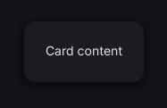

# Card

Content container with a surface and shadow.

[← API index](./README.md)

Source: [`saturn/widgets/basic.py`](../../saturn/widgets/basic.py) (line 301).

## Preview



## Example

Run this code from the repository root to display the control shown above.

```python
import saturn


def main(page: saturn.Page):
    page.window.width = 720
    page.window.height = 360
    page.theme_mode = saturn.ThemeMode.DARK
    page.bgcolor = saturn.Colors.SURFACE
    page.padding = 40
    page.add(saturn.Card(saturn.Container(saturn.Text("Card content"), padding=24), elevation=3))
    page.update()


saturn.run(main, backend=saturn.Renderer.SOFTWARE)
```

**Base class:** [Container](./Container.md)

## Constructor parameters

```python
saturn.Card(content=None, *, elevation: 'float' = 1, variant: 'str' = 'elevated', bgcolor=None, shadow_color=None, shape=None, clip_behavior=None, semantic_container=True, show_border_on_foreground=True, **base)
```

| Parameter | Type annotation | Default | Description |
| --- | --- | --- | --- |
| `content` | `—` | `None` | Text or child control to display. |
| `elevation` | `float` | `1` | Surface elevation, which determines shadow strength. |
| `variant` | `str` | `'elevated'` | Visual variant of this control. |
| `bgcolor` | `—` | `None` | Background color of the control or container. |
| `shadow_color` | `—` | `None` | Color for shadow. |
| `shape` | `—` | `None` | Base shape of the button. |
| `clip_behavior` | `—` | `None` | Clip mode; GPU rotated clips use conservative axis-aligned bounds. |
| `semantic_container` | `—` | `True` | Accessibility container metadata. |
| `show_border_on_foreground` | `—` | `True` | Requested show border on foreground option; see the control comparison for supported values and restrictions. |
| `**base` | `—` | `additional keyword arguments` | Keyword arguments passed to Control, such as width and height. |

`**base` accepts [common Control constructor parameters](./Control.md#constructor-parameters), such as `width`, `height`, and `visible`.
