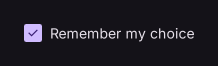

# Checkbox

Input control that can be checked independently.

[← API index](./README.md)

Source: [`saturn/widgets/inputs.py`](../../saturn/widgets/inputs.py) (line 1406).

## Preview



## Example

Run this code from the repository root to display the control shown above.

```python
import saturn


def main(page: saturn.Page):
    page.window.width = 720
    page.window.height = 360
    page.theme_mode = saturn.ThemeMode.DARK
    page.bgcolor = saturn.Colors.SURFACE
    page.padding = 40
    page.add(saturn.Checkbox("Remember my choice", value=True))
    page.update()


saturn.run(main, backend=saturn.Renderer.SOFTWARE)
```

**Base class:** `_Toggle`

## Constructor parameters

```python
saturn.Checkbox(label='', *, value=False, label_position=<LabelPosition.RIGHT: 'right'>, label_style=None, tristate=False, autofocus=False, fill_color=None, overlay_color=None, check_color=None, active_color=None, hover_color=None, focus_color=None, splash_radius=None, border_side=None, error=False, shape=None, visual_density=None, on_change=None, on_focus=None, on_blur=None, **base)
```

| Parameter | Type annotation | Default | Description |
| --- | --- | --- | --- |
| `label` | `—` | `''` | Label beside an input, option, or control. |
| `value` | `—` | `False` | Whether the checkbox is checked. |
| `label_position` | `—` | `<LabelPosition.RIGHT: 'right'>` | Position of the label relative to the selection control. |
| `label_style` | `—` | `None` | Style applied to label. |
| `tristate` | `—` | `False` | Allow Checkbox values True, False, and None. |
| `autofocus` | `—` | `False` | Try to focus this control when the page opens. |
| `fill_color` | `—` | `None` | Background color of a filled input area. |
| `overlay_color` | `—` | `None` | Color for overlay. |
| `check_color` | `—` | `None` | Color for check. |
| `active_color` | `—` | `None` | Color used in the selected or on state. |
| `hover_color` | `—` | `None` | Color used in the hover state. |
| `focus_color` | `—` | `None` | Color for focus. |
| `splash_radius` | `—` | `None` | Pointer feedback radius limit. |
| `border_side` | `—` | `None` | Outline color and thickness as a BorderSide. |
| `error` | `—` | `False` | Error message when an operation fails. |
| `shape` | `—` | `None` | Unsupported for non-default requests. Base shape of the button. |
| `visual_density` | `—` | `None` | Unsupported for non-default requests. Compact, comfortable, or standard control sizing where supported. |
| `on_change` | `—` | `None` | Callback called when the value changes. |
| `on_focus` | `—` | `None` | Callback called when the control gains focus. |
| `on_blur` | `—` | `None` | Callback called when the control loses focus. |
| `**base` | `—` | `additional keyword arguments` | Keyword arguments passed to Control, such as width and height. |

`**base` accepts [common Control constructor parameters](./Control.md#constructor-parameters), such as `width`, `height`, and `visible`.
