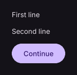

# Column

Arranges child controls vertically.

[← API index](./README.md)

Source: [`saturn/widgets/containers.py`](../../saturn/widgets/containers.py) (line 172).

## Preview



## Example

Run this code from the repository root to display the control shown above.

```python
import saturn


def main(page: saturn.Page):
    page.theme_mode = saturn.ThemeMode.DARK
    page.bgcolor = saturn.Colors.SURFACE
    page.padding = 40
    page.add(saturn.Column([saturn.Text("First line"), saturn.Text("Second line"), saturn.FilledButton("Continue")], spacing=14))
    page.update()


saturn.run(main, backend=saturn.Renderer.SOFTWARE, width=720, height=360)
```

**Base class:** `_Multi`

## Constructor parameters

```python
saturn.Column(*items, controls=None, alignment=<MainAxisAlignment.START: 'start'>, vertical_alignment=None, horizontal_alignment=None, spacing: 'float' = 10, tight: 'bool' = False, **base)
```

| Parameter | Type annotation | Default | Description |
| --- | --- | --- | --- |
| `*items` | `—` | `additional positional arguments` | Items passed to a layout, group, or menu. |
| `controls` | `—` | `None` | Child controls in display order. |
| `alignment` | `—` | `<MainAxisAlignment.START: 'start'>` | Arrangement of children along the vertical main axis. |
| `vertical_alignment` | `—` | `None` | Alignment on the vertical or cross axis. |
| `horizontal_alignment` | `—` | `None` | Alignment on the horizontal or cross axis. |
| `spacing` | `float` | `10` | Space between adjacent child controls. |
| `tight` | `bool` | `False` | Size the layout closely to its children when True. |
| `**base` | `—` | `additional keyword arguments` | Keyword arguments passed to Control, such as width and height. |

`**base` accepts [common Control constructor parameters](./Control.md#constructor-parameters), such as `width`, `height`, and `visible`.
