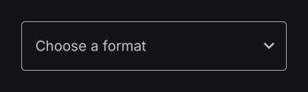

# Dropdown

Selects a value from a list of options.

[← API index](./README.md)

Source: [`saturn/widgets/inputs.py`](../../saturn/widgets/inputs.py) (line 2117).

## Preview



## Example

Run this code from the repository root to display the control shown above.

```python
import saturn


def main(page: saturn.Page):
    page.window.width = 720
    page.window.height = 360
    page.theme_mode = saturn.ThemeMode.DARK
    page.bgcolor = saturn.Colors.SURFACE
    page.padding = 40
    page.add(saturn.Dropdown(hint_text="Choose a format", options=[saturn.Option("pdf", text="PDF"), saturn.Option("csv", text="CSV")], width=300))
    page.update()


saturn.run(main, backend=saturn.Renderer.SOFTWARE)
```

**Base class:** [Control](./Control.md)

## Constructor parameters

```python
saturn.Dropdown(value=None, *, options=None, text=None, hint_text=None, label=None, on_select=None, on_text_change=None, on_focus=None, on_blur=None, autofocus=False, text_size: 'float' = 16.0, text_style=None, text_align=<TextAlign.START: 'start'>, elevation=8, enable_filter=False, enable_search=True, editable=False, menu_height=None, menu_width=None, menu_style=None, expanded_insets=None, selected_suffix=None, input_filter=None, capitalization=None, trailing_icon=None, leading_icon=None, selected_trailing_icon=None, filled=False, fill_color=None, bgcolor=None, border=None, border_radius=None, border_width=None, border_color=None, focused_border_width=None, focused_border_color=None, color=None, content_padding=None, dense=False, hover_color=None, label_style=None, hint_style=None, helper_text=None, helper_style=None, error_text=None, error_style=None, **base)
```

| Parameter | Type annotation | Default | Description |
| --- | --- | --- | --- |
| `value` | `—` | `None` | Key of the currently selected option. |
| `options` | `—` | `None` | Options available in the dropdown menu. |
| `text` | `—` | `None` | Text displayed on the control. |
| `hint_text` | `—` | `None` | Hint shown before a value is entered or selected. |
| `label` | `—` | `None` | Label beside an input, option, or control. |
| `on_select` | `—` | `None` | Callback called when a menu item or option is selected. |
| `on_text_change` | `—` | `None` | Callback for text change; accepts zero arguments or an event. |
| `on_focus` | `—` | `None` | Callback called when the control gains focus. |
| `on_blur` | `—` | `None` | Callback called when the control loses focus. |
| `autofocus` | `—` | `False` | Try to focus this control when the page opens. |
| `text_size` | `float` | `16.0` | Font size of entered or selected text. |
| `text_style` | `—` | `None` | Style of entered or displayed text. |
| `text_align` | `—` | `<TextAlign.START: 'start'>` | Text alignment within the available width. |
| `elevation` | `—` | `8` | Surface elevation, which determines shadow strength. |
| `enable_filter` | `—` | `False` | Filter dropdown options by entered text. |
| `enable_search` | `—` | `True` | Search options while editing the dropdown. |
| `editable` | `—` | `False` | Allow typing in the dropdown's selection field. |
| `menu_height` | `—` | `None` | Maximum height of the bounded dropdown menu. |
| `menu_width` | `—` | `None` | Width of the dropdown menu. |
| `menu_style` | `—` | `None` | Unsupported for non-default requests. Requested menu style option; see the control comparison for supported values and restrictions. |
| `expanded_insets` | `—` | `None` | Unsupported for non-default requests. Requested expanded insets option; see the control comparison for supported values and restrictions. |
| `selected_suffix` | `—` | `None` | Control displayed after the selected dropdown option. |
| `input_filter` | `—` | `None` | Regex InputFilter applied to inserted text. |
| `capitalization` | `—` | `None` | Capitalization applied to inserted text. |
| `trailing_icon` | `—` | `None` | Icon in the secondary action area of a split button. |
| `leading_icon` | `—` | `None` | Icon used for leading. |
| `selected_trailing_icon` | `—` | `None` | Icon used for selected trailing. |
| `filled` | `—` | `False` | Use a filled input area. |
| `fill_color` | `—` | `None` | Background color of a filled input area. |
| `bgcolor` | `—` | `None` | Background color of the control or container. |
| `border` | `—` | `None` | Border settings. |
| `border_radius` | `—` | `None` | Corner radius of the border or background. |
| `border_width` | `—` | `None` | Input outline thickness. |
| `border_color` | `—` | `None` | Border color of the input area. |
| `focused_border_width` | `—` | `None` | Input outline thickness while focused. |
| `focused_border_color` | `—` | `None` | Color for focused border. |
| `color` | `—` | `None` | Color of foreground content, text, or drawing. |
| `content_padding` | `—` | `None` | Insets around content. |
| `dense` | `—` | `False` | Use compact input decoration. |
| `hover_color` | `—` | `None` | Color used in the hover state. |
| `label_style` | `—` | `None` | Style applied to label. |
| `hint_style` | `—` | `None` | Style applied to hint. |
| `helper_text` | `—` | `None` | Text displayed as helper. |
| `helper_style` | `—` | `None` | Style applied to helper. |
| `error_text` | `—` | `None` | Text displayed as error. |
| `error_style` | `—` | `None` | Style applied to error. |
| `**base` | `—` | `additional keyword arguments` | Keyword arguments passed to Control, such as width and height. |

`**base` accepts [common Control constructor parameters](./Control.md#constructor-parameters), such as `width`, `height`, and `visible`.
