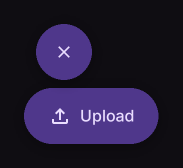

# FloatingActionButtonMenuItem

Clickable item in a floating action menu.

[← API index](./README.md)

Source: [`saturn/widgets/floating.py`](../../saturn/widgets/floating.py) (line 139).

## Preview



## Example

Run this code from the repository root to display the control shown above.

```python
import saturn


def main(page: saturn.Page):
    page.window.width = 720
    page.window.height = 360
    page.theme_mode = saturn.ThemeMode.DARK
    page.bgcolor = saturn.Colors.SURFACE
    page.padding = 40
    page.add(saturn.FloatingActionButtonMenu([saturn.FloatingActionButtonMenuItem("Upload", icon=saturn.Icons.UPLOAD)], expanded=True))
    page.update()


saturn.run(main, backend=saturn.Renderer.SOFTWARE)
```

**Base class:** [ExpressiveButton](./ExpressiveButton.md)

## Constructor parameters

```python
saturn.FloatingActionButtonMenuItem(content, *, icon=None, on_click=None, **base)
```

| Parameter | Type annotation | Default | Description |
| --- | --- | --- | --- |
| `content` | `—` | `required` | Text or child control to display. |
| `icon` | `—` | `None` | Icon to draw. |
| `on_click` | `—` | `None` | Callback called when the control is clicked. |
| `**base` | `—` | `additional keyword arguments` | Keyword arguments passed to Control, such as width and height. |

`**base` accepts [common Control constructor parameters](./Control.md#constructor-parameters), such as `width`, `height`, and `visible`.
