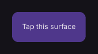

# GestureDetector

Receives pointer and gesture events.

[← API index](./README.md)

Source: [`saturn/widgets/scrolling.py`](../../saturn/widgets/scrolling.py) (line 797).

## Preview



## Example

Run this code from the repository root to display the control shown above.

```python
import saturn


def main(page: saturn.Page):
    page.window.width = 720
    page.window.height = 360
    page.theme_mode = saturn.ThemeMode.DARK
    page.bgcolor = saturn.Colors.SURFACE
    page.padding = 40
    page.add(saturn.GestureDetector(saturn.Container(saturn.Text("Tap this surface"), padding=20, bgcolor=saturn.Colors.PRIMARY_CONTAINER, border_radius=12), on_tap=lambda event: None))
    page.update()


saturn.run(main, backend=saturn.Renderer.SOFTWARE)
```

**Base class:** [Control](./Control.md)

## Constructor parameters

```python
saturn.GestureDetector(content=None, *, on_tap=None, on_tap_down=None, on_long_press=None, on_hover=None, on_enter=None, on_exit=None, mouse_cursor=None, drag_interval=0, hover_interval=0, on_tap_up=None, on_tap_move=None, on_tap_cancel=None, on_double_tap=None, on_double_tap_down=None, on_double_tap_cancel=None, on_horizontal_drag_down=None, on_horizontal_drag_start=None, on_horizontal_drag_update=None, on_horizontal_drag_end=None, on_horizontal_drag_cancel=None, on_vertical_drag_down=None, on_vertical_drag_start=None, on_vertical_drag_update=None, on_vertical_drag_end=None, on_vertical_drag_cancel=None, on_pan_down=None, on_pan_start=None, on_pan_update=None, on_pan_end=None, on_pan_cancel=None, on_scroll=None, allowed_devices=None, exclude_from_semantics=False, multi_tap_touches=0, trackpad_scroll_causes_scale=False, **base)
```

| Parameter | Type annotation | Default | Description |
| --- | --- | --- | --- |
| `content` | `—` | `None` | Text or child control to display. |
| `on_tap` | `—` | `None` | Callback called when a tap completes. |
| `on_tap_down` | `—` | `None` | Callback called when a press begins. |
| `on_long_press` | `—` | `None` | Callback called when the control is long pressed. |
| `on_hover` | `—` | `None` | Callback called when the pointer's hover state changes. |
| `on_enter` | `—` | `None` | Callback called when the pointer enters the control. |
| `on_exit` | `—` | `None` | Callback called when the pointer leaves the control. |
| `mouse_cursor` | `—` | `None` | Cursor displayed while hovering over the control. |
| `drag_interval` | `—` | `0` | Minimum interval between consecutive drag events. |
| `hover_interval` | `—` | `0` | Minimum interval between consecutive hover events. |
| `on_tap_up` | `—` | `None` | Callback for tap up; accepts zero arguments or an event. |
| `on_tap_move` | `—` | `None` | Callback for tap move; accepts zero arguments or an event. |
| `on_tap_cancel` | `—` | `None` | Callback for tap cancel; accepts zero arguments or an event. |
| `on_double_tap` | `—` | `None` | Callback for double tap; accepts zero arguments or an event. |
| `on_double_tap_down` | `—` | `None` | Callback for double tap down; accepts zero arguments or an event. |
| `on_double_tap_cancel` | `—` | `None` | Callback for double tap cancel; accepts zero arguments or an event. |
| `on_horizontal_drag_down` | `—` | `None` | Callback for horizontal drag down; accepts zero arguments or an event. |
| `on_horizontal_drag_start` | `—` | `None` | Callback for horizontal drag start; accepts zero arguments or an event. |
| `on_horizontal_drag_update` | `—` | `None` | Callback for horizontal drag update; accepts zero arguments or an event. |
| `on_horizontal_drag_end` | `—` | `None` | Callback for horizontal drag end; accepts zero arguments or an event. |
| `on_horizontal_drag_cancel` | `—` | `None` | Callback for horizontal drag cancel; accepts zero arguments or an event. |
| `on_vertical_drag_down` | `—` | `None` | Callback for vertical drag down; accepts zero arguments or an event. |
| `on_vertical_drag_start` | `—` | `None` | Callback for vertical drag start; accepts zero arguments or an event. |
| `on_vertical_drag_update` | `—` | `None` | Callback for vertical drag update; accepts zero arguments or an event. |
| `on_vertical_drag_end` | `—` | `None` | Callback for vertical drag end; accepts zero arguments or an event. |
| `on_vertical_drag_cancel` | `—` | `None` | Callback for vertical drag cancel; accepts zero arguments or an event. |
| `on_pan_down` | `—` | `None` | Callback for pan down; accepts zero arguments or an event. |
| `on_pan_start` | `—` | `None` | Callback for pan start; accepts zero arguments or an event. |
| `on_pan_update` | `—` | `None` | Callback for pan update; accepts zero arguments or an event. |
| `on_pan_end` | `—` | `None` | Callback for pan end; accepts zero arguments or an event. |
| `on_pan_cancel` | `—` | `None` | Callback for pan cancel; accepts zero arguments or an event. |
| `on_scroll` | `—` | `None` | Callback called when the list scrolls. |
| `allowed_devices` | `—` | `None` | Pointer device restrictions; non-default requests are unsupported. |
| `exclude_from_semantics` | `—` | `False` | Exclude this control from accessibility semantics. |
| `multi_tap_touches` | `—` | `0` | Unsupported for non-default requests. Requested multi tap touches option; see the control comparison for supported values and restrictions. |
| `trackpad_scroll_causes_scale` | `—` | `False` | Unsupported for non-default requests. Requested trackpad scroll causes scale option; see the control comparison for supported values and restrictions. |
| `**base` | `—` | `additional keyword arguments` | Keyword arguments passed to Control, such as width and height. |

`**base` accepts [common Control constructor parameters](./Control.md#constructor-parameters), such as `width`, `height`, and `visible`.
