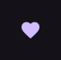

# IconButton

Compact action button presented as an icon.

[← API index](./README.md)

Source: [`saturn/widgets/buttons.py`](../../saturn/widgets/buttons.py) (line 395).

## Preview



## Example

Run this code from the repository root to display the control shown above.

```python
import saturn


def main(page: saturn.Page):
    page.window.width = 720
    page.window.height = 360
    page.theme_mode = saturn.ThemeMode.DARK
    page.bgcolor = saturn.Colors.SURFACE
    page.padding = 40
    page.add(saturn.IconButton(saturn.Icons.FAVORITE, icon_color=saturn.Colors.PRIMARY))
    page.update()


saturn.run(main, backend=saturn.Renderer.SOFTWARE)
```

**Base class:** [Control](./Control.md)

## Public methods

| Method | Description |
| --- | --- |
| `focus(self)` | Focus this attached control when keyboard focus is enabled. |

## Constructor parameters

```python
saturn.IconButton(icon=None, *, icon_size: 'float | None' = None, icon_color=None, selected_icon=None, selected=False, bgcolor=None, hover_color=None, tooltip=None, on_click=None, on_hover=None, selected_icon_color=None, highlight_color=None, style=None, autofocus=False, disabled_color=None, focus_color=None, splash_color=None, splash_radius=None, alignment=None, padding=None, enable_feedback=None, url=None, mouse_cursor=None, visual_density=None, size_constraints=None, on_long_press=None, on_focus=None, on_blur=None, expressive=False, size=None, shape='round', **base)
```

| Parameter | Type annotation | Default | Description |
| --- | --- | --- | --- |
| `icon` | `—` | `None` | Icon to draw. |
| `icon_size` | `float | None` | `None` | Displayed icon size. |
| `icon_color` | `—` | `None` | Foreground color of the icon. |
| `selected_icon` | `—` | `None` | Alternate icon shown when selected. |
| `selected` | `—` | `False` | Whether the list item or icon button is selected. |
| `bgcolor` | `—` | `None` | Background color of the control or container. |
| `hover_color` | `—` | `None` | Color used in the hover state. |
| `tooltip` | `—` | `None` | Short hint shown on hover. |
| `on_click` | `—` | `None` | Callback called when the control is clicked. |
| `on_hover` | `—` | `None` | Callback called when the pointer's hover state changes. |
| `selected_icon_color` | `—` | `None` | Color for selected icon. |
| `highlight_color` | `—` | `None` | Color for highlight. |
| `style` | `—` | `None` | Additional button style settings. |
| `autofocus` | `—` | `False` | Try to focus this control when the page opens. |
| `disabled_color` | `—` | `None` | Color for disabled. |
| `focus_color` | `—` | `None` | Color for focus. |
| `splash_color` | `—` | `None` | Color for splash. |
| `splash_radius` | `—` | `None` | Pointer feedback radius limit. |
| `alignment` | `—` | `None` | Alignment of child content within a container or layout. |
| `padding` | `—` | `None` | Space around the control's content. |
| `enable_feedback` | `—` | `None` | Unsupported for non-default requests. Provide interaction feedback when enabled. |
| `url` | `—` | `None` | Destination opened when the button is clicked. |
| `mouse_cursor` | `—` | `None` | Cursor displayed while hovering over the control. |
| `visual_density` | `—` | `None` | Compact, comfortable, or standard control sizing where supported. |
| `size_constraints` | `—` | `None` | Allowed minimum and maximum dimensions. |
| `on_long_press` | `—` | `None` | Callback called when the control is long pressed. |
| `on_focus` | `—` | `None` | Callback called when the control gains focus. |
| `on_blur` | `—` | `None` | Callback called when the control loses focus. |
| `expressive` | `—` | `False` | Enable Expressive sizing and shape behavior. |
| `size` | `—` | `None` | Size of the text, icon, or control. |
| `shape` | `—` | `'round'` | Base shape of the button. |
| `**base` | `—` | `additional keyword arguments` | Keyword arguments passed to Control, such as width and height. |

`**base` accepts [common Control constructor parameters](./Control.md#constructor-parameters), such as `width`, `height`, and `visible`.
