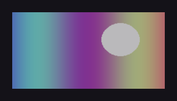

# Image

Displays a local image or SVG.

[← API index](./README.md)

Source: [`saturn/widgets/basic.py`](../../saturn/widgets/basic.py) (line 71).

## Preview



## Example

Run this code from the repository root to display the control shown above.

```python
import saturn


def main(page: saturn.Page):
    page.theme_mode = saturn.ThemeMode.DARK
    page.bgcolor = saturn.Colors.SURFACE
    page.padding = 40
    page.add(saturn.Image("examples/assets/test_img.png", width=300, height=150, border_radius=12))
    page.update()


saturn.run(main, backend=saturn.Renderer.SOFTWARE, width=720, height=360)
```

**Base class:** [Control](./Control.md)

## Constructor parameters

```python
saturn.Image(src=None, *, fit=None, border_radius=None, color=None, **base)
```

| Parameter | Type annotation | Default | Description |
| --- | --- | --- | --- |
| `src` | `—` | `None` | Image source: a local path, bytes, or data URI. |
| `fit` | `—` | `None` | How an image scales and crops within its bounds. |
| `border_radius` | `—` | `None` | Corner radius of the border or background. |
| `color` | `—` | `None` | Optional image tint multiplied with the source pixels. |
| `**base` | `—` | `additional keyword arguments` | Keyword arguments passed to Control, such as width and height. |

`**base` accepts [common Control constructor parameters](./Control.md#constructor-parameters), such as `width`, `height`, and `visible`.
