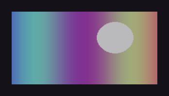

# Image

Displays a local image or SVG.

[← API index](./README.md)

Source: [`saturn/widgets/basic.py`](../../saturn/widgets/basic.py) (line 108).

## Preview



## Example

Run this code from the repository root to display the control shown above.

```python
import saturn


def main(page: saturn.Page):
    page.window.width = 720
    page.window.height = 360
    page.theme_mode = saturn.ThemeMode.DARK
    page.bgcolor = saturn.Colors.SURFACE
    page.padding = 40
    page.add(saturn.Image("examples/assets/test_img.png", width=300, height=150, border_radius=12))
    page.update()


saturn.run(main, backend=saturn.Renderer.SOFTWARE)
```

**Base class:** [Control](./Control.md)

## Constructor parameters

```python
saturn.Image(src=None, *, fit=None, border_radius=None, color=None, error_content=None, repeat='noRepeat', color_blend_mode=None, gapless_playback=False, semantics_label=None, exclude_from_semantics=False, filter_quality='medium', placeholder_src=None, placeholder_fit=None, fade_in_animation=None, placeholder_fade_out_animation=None, cache_width=None, cache_height=None, anti_alias=False, **base)
```

| Parameter | Type annotation | Default | Description |
| --- | --- | --- | --- |
| `src` | `—` | `None` | Image source: a local path, bytes, or data URI. |
| `fit` | `—` | `None` | How an image scales and crops within its bounds. |
| `border_radius` | `—` | `None` | Corner radius of the border or background. |
| `color` | `—` | `None` | Optional image tint multiplied with the source pixels. |
| `error_content` | `—` | `None` | Control shown when an image cannot be decoded. |
| `repeat` | `—` | `'noRepeat'` | Image tiling direction: none, both axes, horizontal, or vertical. |
| `color_blend_mode` | `—` | `None` | Unsupported for non-default requests. Requested color blend mode option; see the control comparison for supported values and restrictions. |
| `gapless_playback` | `—` | `False` | Keep the previous image while a replacement is unavailable. |
| `semantics_label` | `—` | `None` | Accessibility description metadata; native accessibility is not implemented. |
| `exclude_from_semantics` | `—` | `False` | Exclude this control from accessibility semantics. |
| `filter_quality` | `—` | `'medium'` | Sampling quality used when scaling an image. |
| `placeholder_src` | `—` | `None` | Image shown while the requested source is unavailable. |
| `placeholder_fit` | `—` | `None` | BoxFit used for placeholder content. |
| `fade_in_animation` | `—` | `None` | Unsupported for non-default requests. Requested fade in animation option; see the control comparison for supported values and restrictions. |
| `placeholder_fade_out_animation` | `—` | `None` | Unsupported for non-default requests. Requested placeholder fade out animation option; see the control comparison for supported values and restrictions. |
| `cache_width` | `—` | `None` | Requested image cache target width. |
| `cache_height` | `—` | `None` | Requested image cache target height. |
| `anti_alias` | `—` | `False` | Request smooth image edges on the active backend. |
| `**base` | `—` | `additional keyword arguments` | Keyword arguments passed to Control, such as width and height. |

`**base` accepts [common Control constructor parameters](./Control.md#constructor-parameters), such as `width`, `height`, and `visible`.
