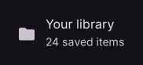

# ListItem

Displays a row with a title, supporting text, and optional slots.

[← API index](./README.md)

Source: [`saturn/widgets/list_item.py`](../../saturn/widgets/list_item.py) (line 30).

## Preview



## Example

Run this code from the repository root to display the control shown above.

```python
import saturn


def main(page: saturn.Page):
    page.theme_mode = saturn.ThemeMode.DARK
    page.bgcolor = saturn.Colors.SURFACE
    page.padding = 40
    page.add(saturn.ListItem("Your library", supporting="24 saved items", leading=saturn.Icon(saturn.Icons.FOLDER), width=400))
    page.update()


saturn.run(main, backend=saturn.Renderer.SOFTWARE, width=720, height=360)
```

**Base class:** [Control](./Control.md)

## Constructor parameters

```python
saturn.ListItem(content=None, *, headline=None, leading=None, trailing=None, overline=None, supporting=None, selected=False, container_color=None, selected_container_color=None, content_color=None, selected_content_color=None, border_radius=None, on_click=None, on_hover=None, on_long_press=None, **base)
```

| Parameter | Type annotation | Default | Description |
| --- | --- | --- | --- |
| `content` | `—` | `None` | Main displayed content of the list item. |
| `headline` | `—` | `None` | Primary title of a list item. |
| `leading` | `—` | `None` | Control or area before the main content. |
| `trailing` | `—` | `None` | Control or area after the main content. |
| `overline` | `—` | `None` | Small text above a list item's title. |
| `supporting` | `—` | `None` | Supporting text below a list item's title. |
| `selected` | `—` | `False` | Whether the list item or icon button is selected. |
| `container_color` | `—` | `None` | Background color of a list item or container in its normal state. |
| `selected_container_color` | `—` | `None` | List item background color when selected. |
| `content_color` | `—` | `None` | Foreground color of list item content in its normal state. |
| `selected_content_color` | `—` | `None` | List item foreground color when selected. |
| `border_radius` | `—` | `None` | Corner radius of the border or background. |
| `on_click` | `—` | `None` | Callback called when the control is clicked. |
| `on_hover` | `—` | `None` | Callback called when the pointer's hover state changes. |
| `on_long_press` | `—` | `None` | Callback called when the control is long pressed. |
| `**base` | `—` | `additional keyword arguments` | Keyword arguments passed to Control, such as width and height. |

`**base` accepts [common Control constructor parameters](./Control.md#constructor-parameters), such as `width`, `height`, and `visible`.
