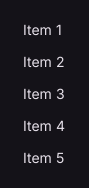

# ListView

Scrollable list of controls.

[← API index](./README.md)

Source: [`saturn/widgets/scrolling.py`](../../saturn/widgets/scrolling.py) (line 28).

## Preview



## Example

Run this code from the repository root to display the control shown above.

```python
import saturn


def main(page: saturn.Page):
    page.theme_mode = saturn.ThemeMode.DARK
    page.bgcolor = saturn.Colors.SURFACE
    page.padding = 40
    page.add(saturn.ListView([saturn.Text(f"Item {i}") for i in range(1, 6)], spacing=12, width=320, height=180))
    page.update()


saturn.run(main, backend=saturn.Renderer.SOFTWARE, width=720, height=360)
```

**Base class:** [Control](./Control.md)

## Public methods

| Method | Description |
| --- | --- |
| `scroll_to(self, offset: 'float' = 0, delta: 'float | None' = None)` | Scrolls to a position or by a specified distance. |

## Constructor parameters

```python
saturn.ListView(*items, controls=None, horizontal: 'bool' = False, spacing: 'float' = 0, item_extent: 'float | None' = None, padding=None, auto_scroll: 'bool' = False, on_scroll=None, **base)
```

| Parameter | Type annotation | Default | Description |
| --- | --- | --- | --- |
| `*items` | `—` | `additional positional arguments` | Items passed to a layout, group, or menu. |
| `controls` | `—` | `None` | Child controls in display order. |
| `horizontal` | `bool` | `False` | Use horizontal scrolling or layout when True. |
| `spacing` | `float` | `0` | Space between adjacent child controls. |
| `item_extent` | `float | None` | `None` | Fixed item height, or width for a horizontal list; enables lazy layout. |
| `padding` | `—` | `None` | Space around the control's content. |
| `auto_scroll` | `bool` | `False` | Scroll to the end automatically as content is added. |
| `on_scroll` | `—` | `None` | Callback called when the list scrolls. |
| `**base` | `—` | `additional keyword arguments` | Keyword arguments passed to Control, such as width and height. |

`**base` accepts [common Control constructor parameters](./Control.md#constructor-parameters), such as `width`, `height`, and `visible`.
