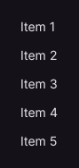

# ListView

Scrollable list of controls.

[← API index](./README.md)

Source: [`saturn/widgets/scrolling.py`](../../saturn/widgets/scrolling.py) (line 124).

## Preview



## Example

Run this code from the repository root to display the control shown above.

```python
import saturn


def main(page: saturn.Page):
    page.window.width = 720
    page.window.height = 360
    page.theme_mode = saturn.ThemeMode.DARK
    page.bgcolor = saturn.Colors.SURFACE
    page.padding = 40
    page.add(saturn.ListView([saturn.Text(f"Item {i}") for i in range(1, 6)], spacing=12, width=320, height=180))
    page.update()


saturn.run(main, backend=saturn.Renderer.SOFTWARE)
```

**Base class:** [Control](./Control.md)

## Public methods

| Method | Description |
| --- | --- |
| `scroll_to(self, offset: 'float' = 0, delta: 'float | None' = None, scroll_key=None, duration=None, curve=None)` | Scrolls to a position or by a specified distance. |

## Constructor parameters

```python
saturn.ListView(*items, controls=None, horizontal: 'bool' = False, spacing: 'float' = 0, item_extent: 'float | None' = None, padding=None, auto_scroll: 'bool' = False, on_scroll=None, reverse=False, first_item_prototype=False, prototype_item=None, divider_thickness=0, clip_behavior='hardEdge', semantic_child_count=None, cache_extent=None, build_controls_on_demand=True, scroll=None, auto_scroll_animation=None, scroll_interval=10, **base)
```

| Parameter | Type annotation | Default | Description |
| --- | --- | --- | --- |
| `*items` | `—` | `additional positional arguments` | Items passed to a layout, group, or menu. |
| `controls` | `—` | `None` | Child controls in display order. |
| `horizontal` | `bool` | `False` | Use horizontal scrolling or layout when True. |
| `spacing` | `float` | `0` | Space between adjacent child controls. |
| `item_extent` | `float | None` | `None` | Fixed item height, or width for a horizontal list; enables lazy layout. |
| `padding` | `—` | `None` | Space around the control's content. |
| `auto_scroll` | `bool` | `False` | Scroll to the end automatically as content is added. |
| `on_scroll` | `—` | `None` | Callback called when the list scrolls. |
| `reverse` | `—` | `False` | Reverse list layout direction. |
| `first_item_prototype` | `—` | `False` | Use the first child's measured extent for all rows. |
| `prototype_item` | `—` | `None` | Control providing the measured extent of every row. |
| `divider_thickness` | `—` | `0` | Thickness of list separators. |
| `clip_behavior` | `—` | `'hardEdge'` | Clip mode; GPU rotated clips use conservative axis-aligned bounds. |
| `semantic_child_count` | `—` | `None` | Declared accessibility child count metadata. |
| `cache_extent` | `—` | `None` | ListView preload distance in logical pixels. |
| `build_controls_on_demand` | `—` | `True` | Place known-height list children lazily while retaining control objects. |
| `scroll` | `—` | `None` | Scroll mode: auto, always, hidden, or none. |
| `auto_scroll_animation` | `—` | `None` | Unsupported for non-default requests. Requested auto scroll animation option; see the control comparison for supported values and restrictions. |
| `scroll_interval` | `—` | `10` | Minimum interval in milliseconds between scroll events. |
| `**base` | `—` | `additional keyword arguments` | Keyword arguments passed to Control, such as width and height. |

`**base` accepts [common Control constructor parameters](./Control.md#constructor-parameters), such as `width`, `height`, and `visible`.
