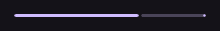

# ProgressBar

Shows determinate or indeterminate progress as a horizontal bar.

[← API index](./README.md)

Source: [`saturn/widgets/basic.py`](../../saturn/widgets/basic.py) (line 366).

## Preview



## Example

Run this code from the repository root to display the control shown above.

```python
import saturn


def main(page: saturn.Page):
    page.window.width = 720
    page.window.height = 360
    page.theme_mode = saturn.ThemeMode.DARK
    page.bgcolor = saturn.Colors.SURFACE
    page.padding = 40
    page.add(saturn.ProgressBar(0.65, width=320))
    page.update()


saturn.run(main, backend=saturn.Renderer.SOFTWARE)
```

**Base class:** [Control](./Control.md)

## Constructor parameters

```python
saturn.ProgressBar(value: 'float | None' = None, *, bar_height: 'float' = 4, color=None, bgcolor=None, border_radius=None, semantics_label=None, semantics_value=None, stop_indicator_color=None, stop_indicator_radius=None, track_gap=None, year_2023=None, **base)
```

| Parameter | Type annotation | Default | Description |
| --- | --- | --- | --- |
| `value` | `float | None` | `None` | Progress, usually from 0 to 1; None means indeterminate. |
| `bar_height` | `float` | `4` | Thickness of the linear progress bar. |
| `color` | `—` | `None` | Color of foreground content, text, or drawing. |
| `bgcolor` | `—` | `None` | Background color of the control or container. |
| `border_radius` | `—` | `None` | Corner radius of the border or background. |
| `semantics_label` | `—` | `None` | Accessibility description metadata; native accessibility is not implemented. |
| `semantics_value` | `—` | `None` | Accessibility value metadata. |
| `stop_indicator_color` | `—` | `None` | Color for stop indicator. |
| `stop_indicator_radius` | `—` | `None` | Radius of the progress end marker. |
| `track_gap` | `—` | `None` | Gap between a progress stroke and its track. |
| `year_2023` | `—` | `None` | Requested year 2023 option; see the control comparison for supported values and restrictions. |
| `**base` | `—` | `additional keyword arguments` | Keyword arguments passed to Control, such as width and height. |

`**base` accepts [common Control constructor parameters](./Control.md#constructor-parameters), such as `width`, `height`, and `visible`.
