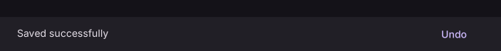

# SnackBar

Displays brief feedback about an action.

[← API index](./README.md)

Source: [`saturn/widgets/dialogs.py`](../../saturn/widgets/dialogs.py) (line 294).

## Preview



## Example

Run this code from the repository root to display the control shown above.

```python
import saturn


def main(page: saturn.Page):
    page.window.width = 720
    page.window.height = 360
    page.theme_mode = saturn.ThemeMode.DARK
    page.bgcolor = saturn.Colors.SURFACE
    page.padding = 40
    page.show_dialog(saturn.SnackBar(saturn.Text("Saved successfully", color=saturn.Colors.ON_SURFACE), action="Undo", bgcolor=saturn.Colors.SURFACE_CONTAINER, duration=10000))
    page.update()


saturn.run(main, backend=saturn.Renderer.SOFTWARE)
```

**Base class:** `DialogControl`

## Constructor parameters

```python
saturn.SnackBar(content, *, action=None, bgcolor=None, duration: 'int' = 4000, on_action=None, open=False, on_dismiss=None, behavior=None, dismiss_direction=None, show_close_icon=False, close_icon_color=None, margin=None, padding=None, width=None, elevation=None, shape=None, clip_behavior='hardEdge', action_overflow_threshold=0.25, persist=None, on_visible=None, **base)
```

| Parameter | Type annotation | Default | Description |
| --- | --- | --- | --- |
| `content` | `—` | `required` | Text or child control to display. |
| `action` | `—` | `None` | Single action label or button on a snackbar. |
| `bgcolor` | `—` | `None` | Background color of the control or container. |
| `duration` | `int` | `4000` | How many milliseconds the snackbar remains visible. |
| `on_action` | `—` | `None` | Callback called when the snackbar action is clicked. |
| `open` | `—` | `False` | Whether the dialog or snackbar is open. |
| `on_dismiss` | `—` | `None` | Callback called when the dialog or snackbar closes. |
| `behavior` | `—` | `None` | Gesture hit-test behavior. |
| `dismiss_direction` | `—` | `None` | Unsupported for non-default requests. Requested dismiss direction option; see the control comparison for supported values and restrictions. |
| `show_close_icon` | `—` | `False` | Show a clickable SnackBar close icon. |
| `close_icon_color` | `—` | `None` | Color for close icon. |
| `margin` | `—` | `None` | Space outside the control. |
| `padding` | `—` | `None` | Space around the control's content. |
| `width` | `—` | `None` | Specified control width. |
| `elevation` | `—` | `None` | Surface elevation, which determines shadow strength. |
| `shape` | `—` | `None` | Base shape of the button. |
| `clip_behavior` | `—` | `'hardEdge'` | Clip mode; GPU rotated clips use conservative axis-aligned bounds. |
| `action_overflow_threshold` | `—` | `0.25` | Width fraction at which the SnackBar action wraps. |
| `persist` | `—` | `None` | Keep the SnackBar open until explicitly dismissed. |
| `on_visible` | `—` | `None` | Callback for visible; accepts zero arguments or an event. |
| `**base` | `—` | `additional keyword arguments` | Keyword arguments passed to Control, such as width and height. |

`**base` accepts [common Control constructor parameters](./Control.md#constructor-parameters), such as `width`, `height`, and `visible`.
