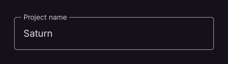

# TextField

Editable text input field.

[← API index](./README.md)

Source: [`saturn/widgets/inputs.py`](../../saturn/widgets/inputs.py) (line 157).

## Preview



## Example

Run this code from the repository root to display the control shown above.

```python
import saturn


def main(page: saturn.Page):
    page.window.width = 720
    page.window.height = 360
    page.theme_mode = saturn.ThemeMode.DARK
    page.bgcolor = saturn.Colors.SURFACE
    page.padding = 40
    page.add(saturn.TextField("Saturn", label="Project name", width=340))
    page.update()


saturn.run(main, backend=saturn.Renderer.SOFTWARE)
```

**Base class:** [Control](./Control.md)

## Constructor parameters

```python
saturn.TextField(value: 'str' = '', *, label=None, hint_text=None, password: 'bool' = False, multiline: 'bool' = False, min_lines: 'int | None' = None, max_lines: 'int | None' = None, read_only: 'bool' = False, max_length: 'int | None' = None, shift_enter: 'bool' = False, ignore_up_down_keys=False, show_cursor: 'bool' = True, obscuring_character: 'str' = '•', text_size: 'float | None' = None, on_change=None, on_submit=None, on_focus=None, on_blur=None, on_click=None, on_tap_outside=None, on_selection_change=None, selection=None, autofocus=False, text_align=None, text_vertical_align=None, can_request_focus=True, ignore_pointers=False, enable_interactive_selection=True, input_filter=None, capitalization=None, keyboard_type=None, cursor_color=None, cursor_error_color=None, cursor_width=2.0, cursor_height=None, cursor_radius=None, selection_color=None, filled: 'bool' = False, bgcolor=None, border_color=None, border_radius: 'float | None' = None, border_width=None, focused_border_color=None, focused_border_width=None, border=None, text_style=None, color=None, focused_color=None, focused_bgcolor=None, fill_color=None, focus_color=None, hover_color=None, content_padding=None, dense=None, collapsed=None, label_style=None, hint_style=None, helper=None, helper_style=None, counter=None, counter_style=None, error=None, error_style=None, prefix=None, prefix_style=None, suffix=None, suffix_style=None, icon=None, prefix_icon=None, suffix_icon=None, can_reveal_password: 'bool' = False, on_hover=None, autocorrect=True, enable_suggestions=True, smart_dashes_type=True, smart_quotes_type=True, enable_ime_personalized_learning=True, enable_stylus_handwriting=True, autofill_hints=None, keyboard_brightness=None, **base)
```

| Parameter | Type annotation | Default | Description |
| --- | --- | --- | --- |
| `value` | `str` | `''` | Initial or current text field content. |
| `label` | `—` | `None` | Label beside an input, option, or control. |
| `hint_text` | `—` | `None` | Hint shown before a value is entered or selected. |
| `password` | `bool` | `False` | Mask entered characters when True. |
| `multiline` | `bool` | `False` | Allow multiple lines of text input. |
| `min_lines` | `int | None` | `None` | Minimum visible lines of multiline input. |
| `max_lines` | `int | None` | `None` | Maximum number of lines to show or accept. |
| `read_only` | `bool` | `False` | Display content without allowing edits when True. |
| `max_length` | `int | None` | `None` | Maximum text length; None or -1 leaves it unlimited. |
| `shift_enter` | `bool` | `False` | Require Shift+Enter to insert a newline in a multiline field. |
| `ignore_up_down_keys` | `—` | `False` | Allow Up/Down keys to reach the application rather than moving the caret. |
| `show_cursor` | `bool` | `True` | Whether to display the input caret. |
| `obscuring_character` | `str` | `'•'` | Single character used to mask password text. |
| `text_size` | `float | None` | `None` | Font size of entered or selected text. |
| `on_change` | `—` | `None` | Callback called when the value changes. |
| `on_submit` | `—` | `None` | Callback called when input is submitted. |
| `on_focus` | `—` | `None` | Callback called when the control gains focus. |
| `on_blur` | `—` | `None` | Callback called when the control loses focus. |
| `on_click` | `—` | `None` | Callback called when the control is clicked. |
| `on_tap_outside` | `—` | `None` | Callback for tap outside; accepts zero arguments or an event. |
| `on_selection_change` | `—` | `None` | Callback for selection change; accepts zero arguments or an event. |
| `selection` | `—` | `None` | TextSelection holding the selected character endpoints. |
| `autofocus` | `—` | `False` | Try to focus this control when the page opens. |
| `text_align` | `—` | `None` | Text alignment within the available width. |
| `text_vertical_align` | `—` | `None` | Vertical placement of TextField content. |
| `can_request_focus` | `—` | `True` | Allow programmatic and keyboard focus when True. |
| `ignore_pointers` | `—` | `False` | Exclude the Container subtree from pointer hit testing. |
| `enable_interactive_selection` | `—` | `True` | Allow pointer/keyboard selection and copy. |
| `input_filter` | `—` | `None` | Regex InputFilter applied to inserted text. |
| `capitalization` | `—` | `None` | Capitalization applied to inserted text. |
| `keyboard_type` | `—` | `None` | Requested keyboard type option; see the control comparison for supported values and restrictions. |
| `cursor_color` | `—` | `None` | Color of the text insertion cursor. |
| `cursor_error_color` | `—` | `None` | Color for cursor error. |
| `cursor_width` | `—` | `2.0` | Input caret width. |
| `cursor_height` | `—` | `None` | Input caret height. |
| `cursor_radius` | `—` | `None` | Input caret corner radius. |
| `selection_color` | `—` | `None` | Color for selection. |
| `filled` | `bool` | `False` | Use a filled input area. |
| `bgcolor` | `—` | `None` | Background color of the control or container. |
| `border_color` | `—` | `None` | Border color of the input area. |
| `border_radius` | `float | None` | `None` | Corner radius of the border or background. |
| `border_width` | `—` | `None` | Input outline thickness. |
| `focused_border_color` | `—` | `None` | Color for focused border. |
| `focused_border_width` | `—` | `None` | Input outline thickness while focused. |
| `border` | `—` | `None` | Border settings. |
| `text_style` | `—` | `None` | Style of entered or displayed text. |
| `color` | `—` | `None` | Color of foreground content, text, or drawing. |
| `focused_color` | `—` | `None` | Color for focused. |
| `focused_bgcolor` | `—` | `None` | Background color for focused. |
| `fill_color` | `—` | `None` | Background color of a filled input area. |
| `focus_color` | `—` | `None` | Color for focus. |
| `hover_color` | `—` | `None` | Color used in the hover state. |
| `content_padding` | `—` | `None` | Insets around content. |
| `dense` | `—` | `None` | Use compact input decoration. |
| `collapsed` | `—` | `None` | Remove ordinary input decoration spacing. |
| `label_style` | `—` | `None` | Style applied to label. |
| `hint_style` | `—` | `None` | Style applied to hint. |
| `helper` | `—` | `None` | Control below the input providing helper content. |
| `helper_style` | `—` | `None` | Style applied to helper. |
| `counter` | `—` | `None` | Control beside input helper/error content. |
| `counter_style` | `—` | `None` | Style applied to counter. |
| `error` | `—` | `None` | Error message when an operation fails. |
| `error_style` | `—` | `None` | Style applied to error. |
| `prefix` | `—` | `None` | Control before the editable input text. |
| `prefix_style` | `—` | `None` | Style applied to prefix. |
| `suffix` | `—` | `None` | Control after the editable input text. |
| `suffix_style` | `—` | `None` | Style applied to suffix. |
| `icon` | `—` | `None` | Icon to draw. |
| `prefix_icon` | `—` | `None` | Icon used for prefix. |
| `suffix_icon` | `—` | `None` | Icon used for suffix. |
| `can_reveal_password` | `bool` | `False` | Show a button for toggling password visibility. |
| `on_hover` | `—` | `None` | Callback called when the pointer's hover state changes. |
| `autocorrect` | `—` | `True` | Unsupported for non-default requests. Requested autocorrect option; see the control comparison for supported values and restrictions. |
| `enable_suggestions` | `—` | `True` | Unsupported for non-default requests. Requested enable suggestions option; see the control comparison for supported values and restrictions. |
| `smart_dashes_type` | `—` | `True` | Unsupported for non-default requests. Requested smart dashes type option; see the control comparison for supported values and restrictions. |
| `smart_quotes_type` | `—` | `True` | Unsupported for non-default requests. Requested smart quotes type option; see the control comparison for supported values and restrictions. |
| `enable_ime_personalized_learning` | `—` | `True` | Unsupported for non-default requests. Requested enable ime personalized learning option; see the control comparison for supported values and restrictions. |
| `enable_stylus_handwriting` | `—` | `True` | Unsupported for non-default requests. Requested enable stylus handwriting option; see the control comparison for supported values and restrictions. |
| `autofill_hints` | `—` | `None` | Unsupported for non-default requests. Requested autofill hints option; see the control comparison for supported values and restrictions. |
| `keyboard_brightness` | `—` | `None` | Unsupported for non-default requests. Requested keyboard brightness option; see the control comparison for supported values and restrictions. |
| `**base` | `—` | `additional keyword arguments` | Keyword arguments passed to Control, such as width and height. |

`**base` accepts [common Control constructor parameters](./Control.md#constructor-parameters), such as `width`, `height`, and `visible`.
