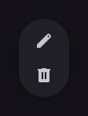

# VerticalFloatingToolbar

Floating toolbar with vertically arranged actions.

[← API index](./README.md)

Source: [`saturn/widgets/floating.py`](../../saturn/widgets/floating.py) (line 134).

## Preview



## Example

Run this code from the repository root to display the control shown above.

```python
import saturn


def main(page: saturn.Page):
    page.window.width = 720
    page.window.height = 360
    page.theme_mode = saturn.ThemeMode.DARK
    page.bgcolor = saturn.Colors.SURFACE
    page.padding = 40
    page.add(saturn.VerticalFloatingToolbar(saturn.IconButton(saturn.Icons.EDIT), saturn.IconButton(saturn.Icons.DELETE)))
    page.update()


saturn.run(main, backend=saturn.Renderer.SOFTWARE)
```

**Base class:** [FloatingToolbar](./FloatingToolbar.md)

## Constructor parameters

```python
saturn.VerticalFloatingToolbar(*items, **kwargs)
```

| Parameter | Type annotation | Default | Description |
| --- | --- | --- | --- |
| `*items` | `—` | `additional positional arguments` | Items passed to a layout, group, or menu. |
| `**kwargs` | `—` | `additional keyword arguments` | Keyword arguments passed to the parent constructor. |
