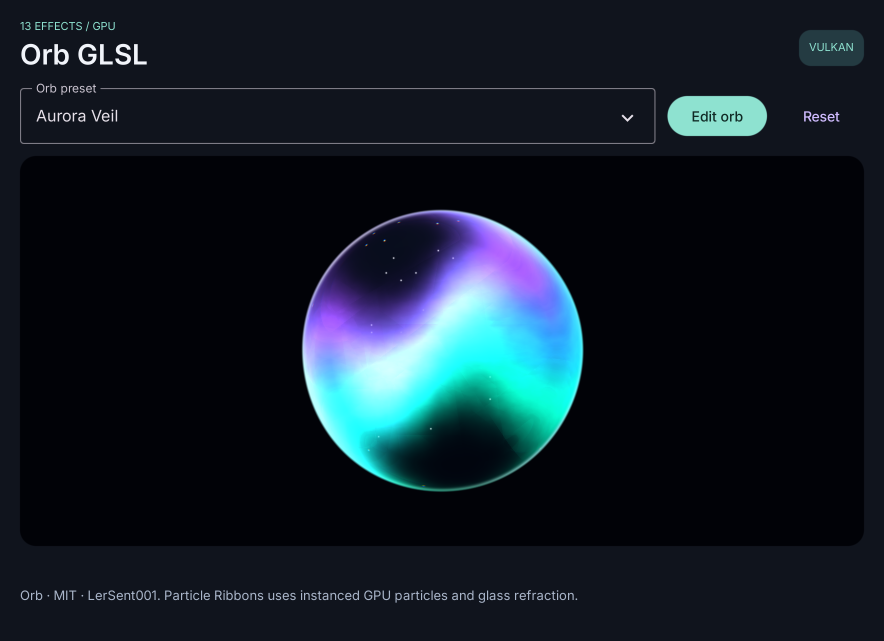

# Native Subpage and Shader demos

Run from the repository root with Saturn installed in the active environment.
All examples accept `--backend opengl`, `--backend vulkan`, or
`--backend software`; OpenGL is the default. Main windows start at 900 × 680.

## Native preferences

```sh
python examples/subpage_settings.py --backend vulkan --screen settings
python examples/subpage_settings.py --backend opengl --screen appearance
```

Preferences opens a separate owned window. Edit the workspace name to update
the main window, hide/show the same settings window, attach it to the main
window's right side, or open Appearance as a grandchild. The main Page's route
handler opens windows for `/settings` and `/settings/appearance`. Preferences
are in-memory application state; the notification switch sends no OS notices.

## Built-in effect gallery

```sh
python examples/shader_gallery.py --backend vulkan
```

Four previews show Gradient, Noise, Ripple and Plasma. Change their shared
palette, pause/resume animation, or reset values. This gallery uses one window.

## Native shader editor

```sh
python examples/shader_playground.py --backend vulkan --screen editor
```

The independent settings window changes the main preview's effect, speed,
intensity and animation flag immediately.

## Orb Aurora GLSL

```sh
python examples/orb_glsl.py --backend opengl --screen editor
python examples/orb_glsl.py --backend vulkan --screen editor
```

This uses custom GLSL and a nested `#include` file. The native parameter window
controls glass refraction, width, zoom, warp and exposure. Vulkan requires
glslangValidator on PATH or `SATURN_GLSLANG` set to the compiler executable;
see [Shaders](./shaders.md). Software displays the static fallback color.



The Aurora noise/fluid and glass shell are adapted from
[LerSent001/orb](https://github.com/LerSent001/orb), Copyright (c) 2026 LerSent001,
under the [MIT license](../.static/shaders/ORB-LICENSE.txt). The complete license
and copyright notice are retained beside the GLSL sources. Other presets, the WebGPU
editor and multipass particle ribbons are not part of this example.

Each example exposes `build(page)` returning its controls/state. Native
examples also return `open_screen(name)` for launching their child windows.
`tests/effects_demo_checks.py` exercises actual windows, cross-window changes,
uniforms and pixels on all three renderers. Native screenshots are captured
with Vulkan into `.static/shots`. See [Subpages](./subpages.md).
