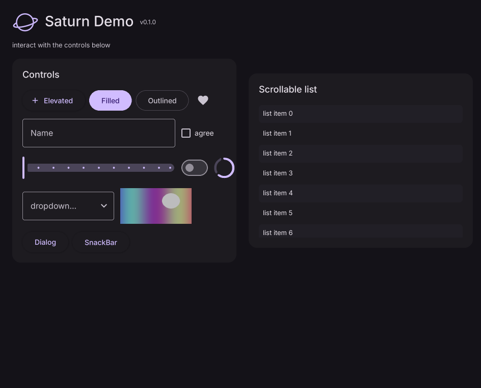
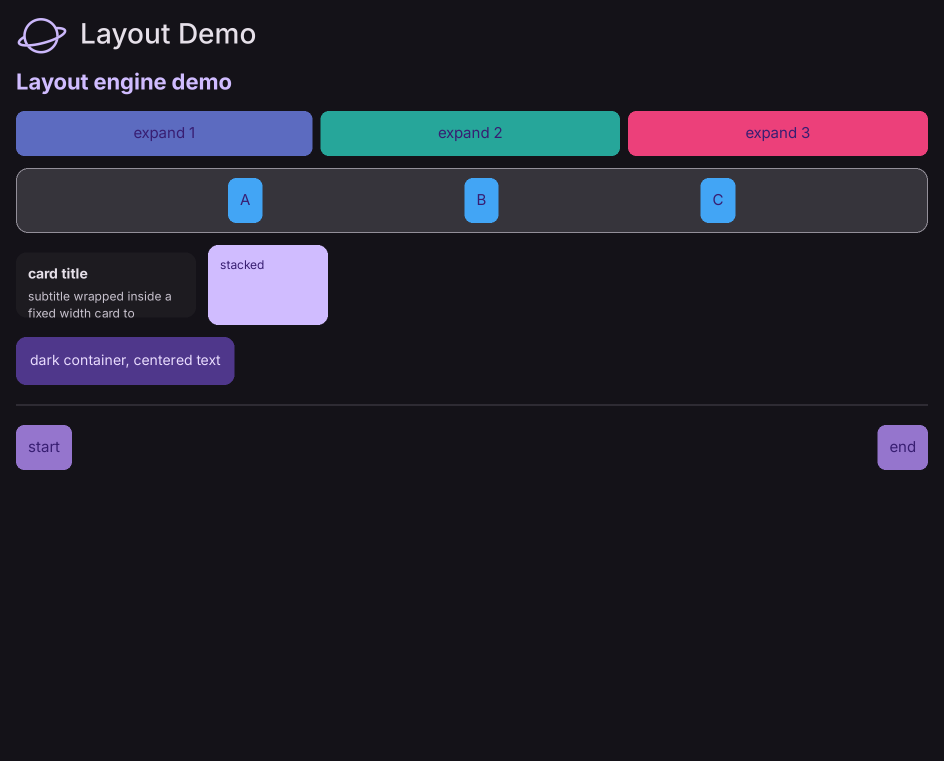
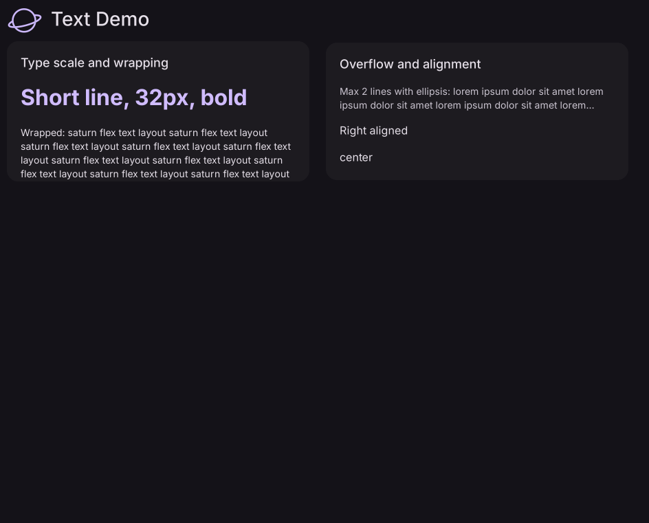
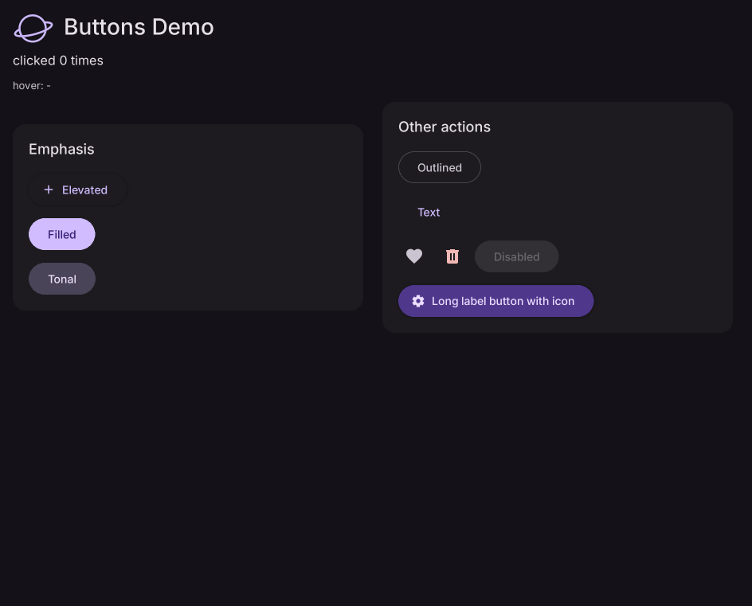
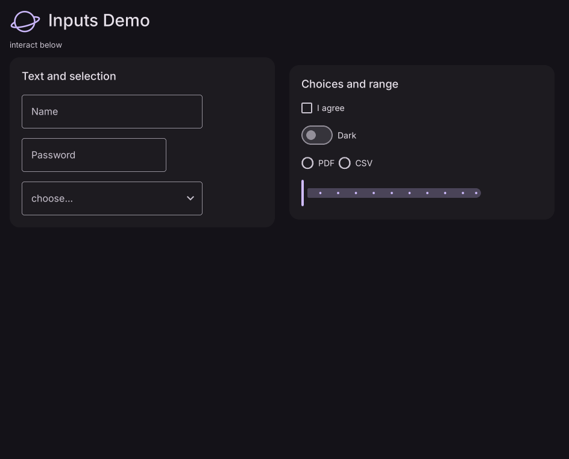
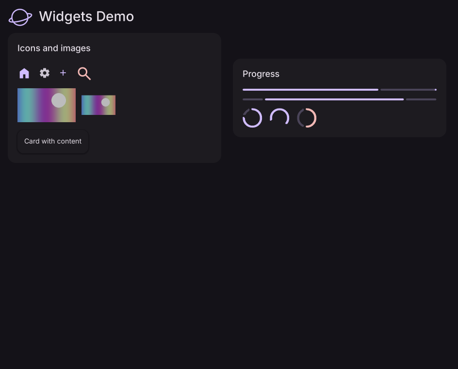
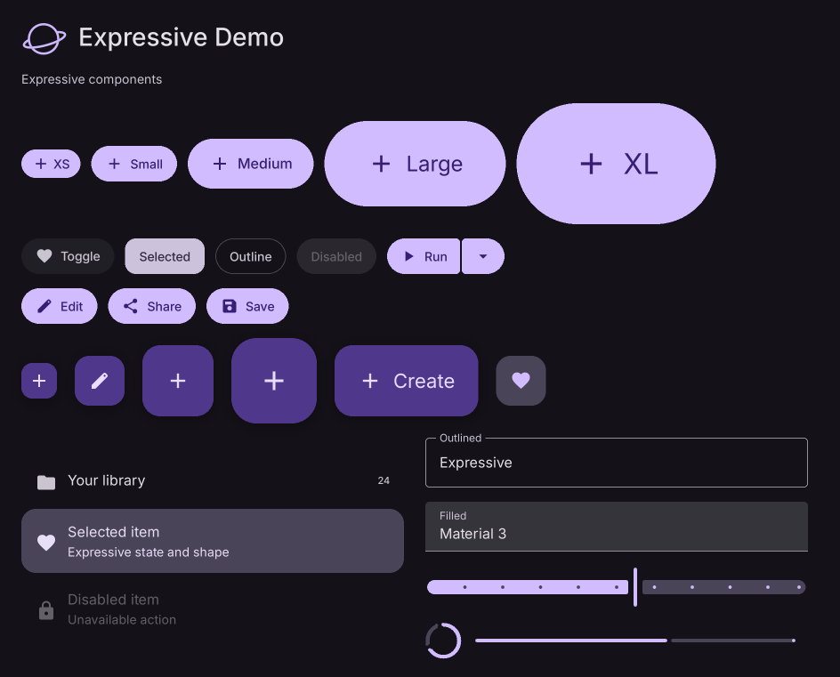
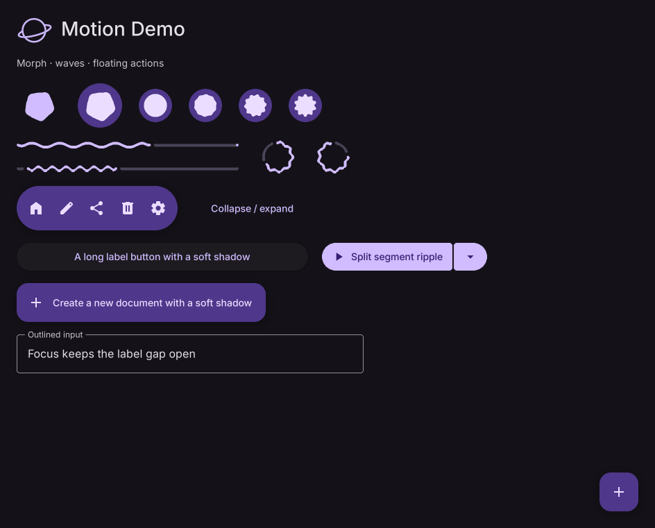
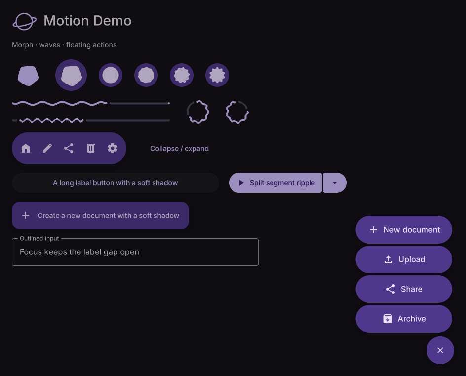

# Screenshot gallery

[← Documentation home](./README.md) · [API index](./api/README.md)

These images come from Saturn examples in this repository. Open the linked source files to run each example locally and inspect its interactions.

All examples use a 960 × 800 window and a dark theme, with the classic transparent Saturn logo before each title.

## Basic controls

### Hello

[Run `examples/hello.py`](../examples/hello.py) · [Get started in five minutes](./getting-started.md)

### Full demo

[Run `examples/demo.py`](../examples/demo.py) · [Page](./api/Page.md) · [ListView](./api/ListView.md)

### Layout and text

[Layout example](../examples/layout_demo.py) · [Row](./api/Row.md) · [Column](./api/Column.md) · [Stack](./api/Stack.md)

[Text example](../examples/text_demo.py) · [Text](./api/Text.md) · [TextStyle](./api/TextStyle.md)

### Buttons, inputs, and content

[Button example](../examples/buttons_demo.py) · [Button](./api/Button.md) · [FilledButton](./api/FilledButton.md)

[Input example](../examples/inputs_demo.py) · [TextField](./api/TextField.md) · [Dropdown](./api/Dropdown.md)

[Content example](../examples/widgets_demo.py) · [Image](./api/Image.md) · [Card](./api/Card.md)

## Material Expressive

[Expressive example](../examples/expressive_demo.py) · [ExpressiveButton](./api/ExpressiveButton.md) · [MaterialExpressiveTheme](./api/MaterialExpressiveTheme.md)

### Motion and floating menu

[Motion example](../examples/expressive_motion_demo.py) · [LoadingIndicator](./api/LoadingIndicator.md) · [FloatingActionButtonMenu](./api/FloatingActionButtonMenu.md)

| Animated controls | Expanded menu |
| --- | --- |
|  |  |

Each screenshot captures one frame. Run the linked example to see animation, hover, click, and input behavior.
