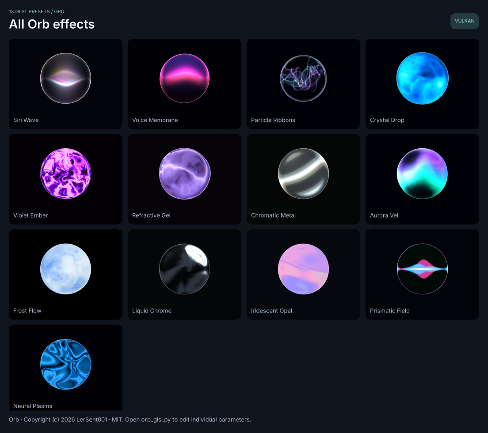

# Orb GLSL presets

Saturn's Orb examples include all 13 curated presets from
[LerSent001/orb](https://github.com/LerSent001/orb), with upstream default
parameters and colors. The upstream name is **Aurora Veil**.

## Run

```sh
python examples/orb_glsl.py --backend opengl --screen editor
python examples/orb_glsl.py --backend vulkan --screen editor
python examples/orb_gallery.py --backend vulkan
```

Vulkan custom GLSL requires `glslangValidator` on PATH or `SATURN_GLSLANG`
pointing to its executable. OpenGL compiles with its driver. First compilation
can pause the UI; subsequent uniform edits reuse the programs. Software draws
static fallback colors. See [Shaders](./shaders.md).



## Catalog

| Name | Preset ID | Rendering |
| --- | --- | --- |
| Siri Wave | `siri` | Colored emissive sheets |
| Voice Membrane | `voiceWave` | Animated membrane and deformed contour |
| Particle Ribbons | `particleRibbon` | Instanced particles followed by glass refraction |
| Crystal Drop | `blueDrop` | Blue liquid field and deformed contour |
| Violet Ember | `violetEmber` | Molten violet field |
| Refractive Gel | `refractiveBlob` | Fluid field and perturbed refraction normals |
| Chromatic Metal | `chromaticMetal` | Moving brushed-metal field |
| Aurora Veil | `aurora` | Colored curtains and stars |
| Frost Flow | `frost` | Frosted fluid layers |
| Liquid Chrome | `chrome` | Reflective liquid field |
| Iridescent Opal | `opal` | Opalescent interference |
| Prismatic Field | `spectrum` | Symmetric colored waves |
| Neural Plasma | `plasma` | Neural interference field |

## Editor and reuse

Choose a preset in `orb_glsl.py` and open **Edit orb**. The settings window is
an owned native Subpage. Changes update the main window immediately. Each
preset retains its edited parameters when switching; **Reset** restores its
defaults. Settings include speed, radius, fluid controls, glass refraction,
edge softness/glow, twelve color roles, and the selected effect's extra knobs.
Particle controls include density, count, width, twist, fold, breath, size and
bloom. Metal controls include scale, stretch, angle, offset, phase, evolution,
roughness and depth.

```python
from examples.orb_catalog import ASSETS, PARTICLES, orb_uniforms
import saturn

aurora = saturn.Shader(shader=ASSETS / "orb-presets.glsl",
                       uniforms=orb_uniforms("aurora"))
particles = saturn.Shader(shader=ASSETS / "orb-particles.glsl",
                          buffer=PARTICLES,
                          uniforms=orb_uniforms("particleRibbon"))
aurora.uniforms["orb_exposure"] = 1.5
aurora.update()
```

`orb-presets.json` stores readable upstream values. `orb_uniforms()` prefixes
parameter names with `orb_` and converts hex colors to normalized RGBA vectors.
The shared GLSL dispatches on `orb_style`. These assets are example resources;
applications distributing them should include the GLSL files and Orb license.

## GPU implementation and verification

The twelve fluid programs and glass calculations are converted from the
upstream typed Metal export of `effect.wgsl`. Particle Ribbons ports its vertex,
fragment and composite programs. The GPU computes all 221,184 particle
instances, accumulates them into an RGBA8 offscreen image, then samples that
image with three-channel glass refraction. Targets are reused and resized with
the local Shader dimensions. There is no CPU particle simulation, effect
rasterization or per-frame bitmap upload. Saturn converts final premultiplied
output to straight alpha and applies its control opacity, clip and transform.
Floating-point and compiler differences mean pixels need not be identical to
WebGPU or another driver. The old simplified Aurora asset is retained for
existing consumers; the new catalog uses the complete shared port.

```sh
python tests/orb_shader_checks.py opengl
python tests/orb_shader_checks.py vulkan
python tests/effects_demo_checks.py vulkan
```

The GPU checks exercise all 13 unique outputs, animation, glass toggles,
particle density, target reuse and resize, and painter order. CPU surface
allocation and bitmap serialization are forbidden during effect drawing.
The demo checks exercise preset switching, native editors and the gallery.
The demo screenshots are saved in `.static/shots`; per-preset diagnostic
images from the GPU checks are saved in the ignored `.build-probe/orb-shots`.

To regenerate assets from an upstream checkout:

```sh
python tools/port_orb_shaders.py --source /path/to/orb
```

## Attribution

Original project: [LerSent001/orb](https://github.com/LerSent001/orb).
Copyright (c) 2026 LerSent001. Distributed under the
[MIT license](../.static/shaders/ORB-LICENSE.txt). The complete copyright and
permission notice is retained beside the shader sources and linked in README.
