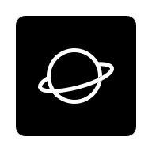
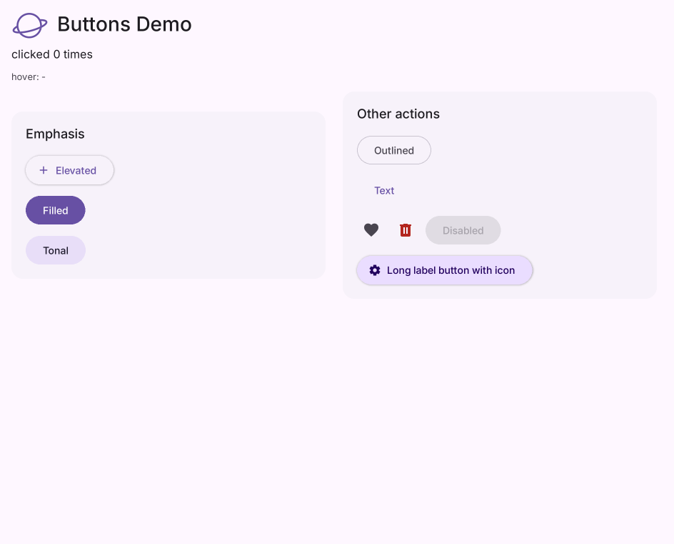

# Saturn documentation

Saturn is a lightweight UI framework for Python desktop applications. These docs use categories similar to the repository's `flet-skill/` reference, making it easy to find Saturn equivalents for familiar Flet concepts. The content reflects the code in this repository version.

> Saturn is still in alpha. Public APIs may change, and controls with Flet names may differ in their parameters or behavior.

## Start here

| Guide | What it covers |
| --- | --- |
| [Get started in five minutes](./getting-started.md) | Install Saturn, open a window, and handle an event |
| [API index](./api/README.md) | Control descriptions, screenshots, code, and constructor parameters |
| [Screenshot gallery](./gallery.md) | Dark theme layouts, buttons, inputs, and animated controls |
| [Logo design](./branding.md) | Classic logo and transparent variant |
| [Flet mapping and scope](./flet-mapping.md) | Name mappings and implemented coverage |
| [Expressive controls](../docs/expressive.md) | Expressive implementation notes and examples |

## Common APIs

- Page and runtime: [run](./api/run.md), [Page](./api/Page.md), [Control](./api/Control.md)
- Layout: [Row](./api/Row.md), [Column](./api/Column.md), [Container](./api/Container.md), [Stack](./api/Stack.md)
- Content: [Text](./api/Text.md), [Icon](./api/Icon.md), [Image](./api/Image.md)
- Interaction: [Button](./api/Button.md), [TextField](./api/TextField.md), [Dropdown](./api/Dropdown.md)
- Themes: [Theme](./api/Theme.md), [Colors](./api/Colors.md), [MaterialExpressiveTheme](./api/MaterialExpressiveTheme.md)

API pages are generated by `python tools/build_saturn_docs.py`; this command leaves the hand-written guides untouched.
