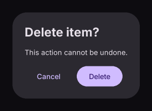

# AlertDialog

Displays a modal dialog on the page.

[← API index](./README.md)

Source: [`saturn/widgets/dialogs.py`](../../saturn/widgets/dialogs.py) (line 69).

## Preview



## Example

Run this code from the repository root to display the control shown above.

```python
import saturn


def main(page: saturn.Page):
    page.theme_mode = saturn.ThemeMode.DARK
    page.bgcolor = saturn.Colors.SURFACE
    page.padding = 40
    page.show_dialog(saturn.AlertDialog(title="Delete item?", content=saturn.Text("This action cannot be undone."), actions=[saturn.TextButton("Cancel"), saturn.FilledButton("Delete")]))
    page.update()


saturn.run(main, backend=saturn.Render.SOFTWARE, width=720, height=360)
```

**Base class:** `DialogControl`

## Constructor parameters

```python
saturn.AlertDialog(title=None, content=None, *, actions=None, modal=False, bgcolor=None, open=False, on_dismiss=None, **base)
```

| Parameter | Type annotation | Default | Description |
| --- | --- | --- | --- |
| `title` | `—` | `None` | Title of a dialog, notification, or window. |
| `content` | `—` | `None` | Text or child control to display. |
| `actions` | `—` | `None` | Action buttons at the bottom of a dialog. |
| `modal` | `—` | `False` | Prevent closing the dialog by clicking its barrier when True. |
| `bgcolor` | `—` | `None` | Background color of the control or container. |
| `open` | `—` | `False` | Whether the dialog or snackbar is open. |
| `on_dismiss` | `—` | `None` | Callback called when the dialog or snackbar closes. |
| `**base` | `—` | `additional keyword arguments` | Keyword arguments passed to Control, such as width and height. |

`**base` accepts [common Control constructor parameters](./Control.md#constructor-parameters), such as `width`, `height`, and `visible`.
