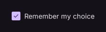

# Checkbox

Input control that can be checked independently.

[← API index](./README.md)

Source: [`saturn/widgets/inputs.py`](../../saturn/widgets/inputs.py) (line 931).

## Preview



## Example

Run this code from the repository root to display the control shown above.

```python
import saturn


def main(page: saturn.Page):
    page.theme_mode = saturn.ThemeMode.DARK
    page.bgcolor = saturn.Colors.SURFACE
    page.padding = 40
    page.add(saturn.Checkbox("Remember my choice", value=True))
    page.update()


saturn.run(main, backend=saturn.Render.SOFTWARE, width=720, height=360)
```

**Base class:** `_Toggle`

## Constructor parameters

```python
saturn.Checkbox(label: 'str' = '', *, value=False, active_color=None, label_position=<LabelPosition.RIGHT: 'right'>, on_change=None, **base)
```

| Parameter | Type annotation | Default | Description |
| --- | --- | --- | --- |
| `label` | `str` | `''` | Label beside an input, option, or control. |
| `value` | `—` | `False` | Whether the checkbox is checked. |
| `active_color` | `—` | `None` | Color used in the selected or on state. |
| `label_position` | `—` | `<LabelPosition.RIGHT: 'right'>` | Position of the label relative to the selection control. |
| `on_change` | `—` | `None` | Callback called when the value changes. |
| `**base` | `—` | `additional keyword arguments` | Keyword arguments passed to Control, such as width and height. |

`**base` accepts [common Control constructor parameters](./Control.md#constructor-parameters), such as `width`, `height`, and `visible`.
