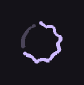

# CircularWavyProgressIndicator

Circular wavy progress indicator.

[← API index](./README.md)

Source: [`saturn/widgets/expressive_progress.py`](../../saturn/widgets/expressive_progress.py) (line 218).

## Preview



## Example

Run this code from the repository root to display the control shown above.

```python
import saturn


def main(page: saturn.Page):
    page.theme_mode = saturn.ThemeMode.DARK
    page.bgcolor = saturn.Colors.SURFACE
    page.padding = 40
    page.add(saturn.CircularWavyProgressIndicator(0.65))
    page.update()


saturn.run(main, backend=saturn.Render.SOFTWARE, width=720, height=360)
```

**Base class:** [WavyProgressIndicator](./WavyProgressIndicator.md)

## Constructor parameters

```python
saturn.CircularWavyProgressIndicator(value=None, *, color=None, bgcolor=None, stroke_width=4, amplitude=None, wavelength=None, wave_speed=1.0, **base)
```

| Parameter | Type annotation | Default | Description |
| --- | --- | --- | --- |
| `value` | `—` | `None` | Current value of the control or data object. |
| `color` | `—` | `None` | Color of foreground content, text, or drawing. |
| `bgcolor` | `—` | `None` | Background color of the control or container. |
| `stroke_width` | `—` | `4` | Width of a progress ring or wave stroke. |
| `amplitude` | `—` | `None` | Height of the wave relative to its baseline. |
| `wavelength` | `—` | `None` | Distance between adjacent wave peaks. |
| `wave_speed` | `—` | `1.0` | Movement speed of the wave animation. |
| `**base` | `—` | `additional keyword arguments` | Keyword arguments passed to Control, such as width and height. |

`**base` accepts [common Control constructor parameters](./Control.md#constructor-parameters), such as `width`, `height`, and `visible`.
