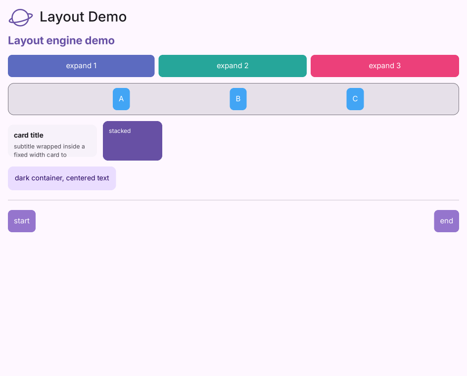

# Container

为子控件添加间距、背景、边框等装饰。

[← API 索引](./README.md)

源码：[`saturn/widgets/containers.py`](../../saturn/widgets/containers.py)（第 194 行）。

**基类：** [Control](./Control.md)

## 构造

```python
ft.Container(content=None, *, padding=None, bgcolor=None, border=None, border_radius=None, alignment=None, gradient=None, shadow=None, ink=False, animate=None, on_click=None, on_hover=None, on_long_press=None, **base)
```

### 参数

| 参数 | 类型标注 | 默认值 |
| --- | --- | --- |
| `content` | `—` | `None` |
| `padding` | `—` | `None` |
| `bgcolor` | `—` | `None` |
| `border` | `—` | `None` |
| `border_radius` | `—` | `None` |
| `alignment` | `—` | `None` |
| `gradient` | `—` | `None` |
| `shadow` | `—` | `None` |
| `ink` | `—` | `False` |
| `animate` | `—` | `None` |
| `on_click` | `—` | `None` |
| `on_hover` | `—` | `None` |
| `on_long_press` | `—` | `None` |
| `base` | `—` | `额外关键字参数` |

## 本类属性

`alignment`、`animate`、`bgcolor`、`border`、`border_radius`、`content`、`gradient`、`ink`、`padding`、`shadow`。

## 事件回调

`on_click`、`on_hover`、`on_long_press`。

## 效果预览



---

本页依据仓库当前公开 API 与源码生成。继承成员请查阅基类；参数表中的 `**base` 会传给基类。
