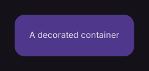

# Container

Adds spacing, background, borders, and other decoration to a child.

[← API index](./README.md)

Source: [`saturn/widgets/containers.py`](../../saturn/widgets/containers.py) (line 194).

## Preview



## Example

Run this code from the repository root to display the control shown above.

```python
import saturn


def main(page: saturn.Page):
    page.theme_mode = saturn.ThemeMode.DARK
    page.bgcolor = saturn.Colors.SURFACE
    page.padding = 40
    page.add(saturn.Container(saturn.Text("A decorated container"), padding=24, bgcolor=saturn.Colors.PRIMARY_CONTAINER, border_radius=16))
    page.update()


saturn.run(main, backend=saturn.Render.SOFTWARE, width=720, height=360)
```

**Base class:** [Control](./Control.md)

## Constructor parameters

```python
saturn.Container(content=None, *, padding=None, bgcolor=None, border=None, border_radius=None, alignment=None, gradient=None, shadow=None, ink=False, animate=None, on_click=None, on_hover=None, on_long_press=None, **base)
```

| Parameter | Type annotation | Default | Description |
| --- | --- | --- | --- |
| `content` | `—` | `None` | Text or child control to display. |
| `padding` | `—` | `None` | Space around the control's content. |
| `bgcolor` | `—` | `None` | Background color of the control or container. |
| `border` | `—` | `None` | Border settings. |
| `border_radius` | `—` | `None` | Corner radius of the border or background. |
| `alignment` | `—` | `None` | Alignment of content inside the container. |
| `gradient` | `—` | `None` | Gradient used to fill the background. |
| `shadow` | `—` | `None` | Shadow outside the control. |
| `ink` | `—` | `False` | Whether to draw ripple feedback on clicks. |
| `animate` | `—` | `None` | Animation settings applied when a property changes. |
| `on_click` | `—` | `None` | Callback called when the control is clicked. |
| `on_hover` | `—` | `None` | Callback called when the pointer's hover state changes. |
| `on_long_press` | `—` | `None` | Callback called when the control is long pressed. |
| `**base` | `—` | `additional keyword arguments` | Keyword arguments passed to Control, such as width and height. |

`**base` accepts [common Control constructor parameters](./Control.md#constructor-parameters), such as `width`, `height`, and `visible`.
