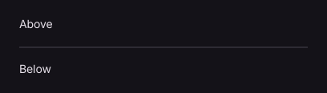

# Divider

Draws a dividing line between adjacent content.

[← API index](./README.md)

Source: [`saturn/widgets/containers.py`](../../saturn/widgets/containers.py) (line 411).

## Preview



## Example

Run this code from the repository root to display the control shown above.

```python
import saturn


def main(page: saturn.Page):
    page.theme_mode = saturn.ThemeMode.DARK
    page.bgcolor = saturn.Colors.SURFACE
    page.padding = 40
    page.add(saturn.Column([saturn.Text("Above"), saturn.Divider(), saturn.Text("Below")], width=360))
    page.update()


saturn.run(main, backend=saturn.Render.SOFTWARE, width=720, height=360)
```

**Base class:** [Control](./Control.md)

## Constructor parameters

```python
saturn.Divider(*, height: 'float' = 16, thickness: 'float' = 1, color=None, leading_indent: 'float' = 0, trailing_indent: 'float' = 0, **base)
```

| Parameter | Type annotation | Default | Description |
| --- | --- | --- | --- |
| `height` | `float` | `16` | Specified control height. |
| `thickness` | `float` | `1` | Thickness of a line or divider. |
| `color` | `—` | `None` | Color of foreground content, text, or drawing. |
| `leading_indent` | `float` | `0` | Inset at the start of a divider. |
| `trailing_indent` | `float` | `0` | Inset at the end of a divider. |
| `**base` | `—` | `additional keyword arguments` | Keyword arguments passed to Control, such as width and height. |

`**base` accepts [common Control constructor parameters](./Control.md#constructor-parameters), such as `width`, `height`, and `visible`.
