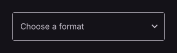

# Dropdown

Selects a value from a list of options.

[← API index](./README.md)

Source: [`saturn/widgets/inputs.py`](../../saturn/widgets/inputs.py) (line 1468).

## Preview



## Example

Run this code from the repository root to display the control shown above.

```python
import saturn


def main(page: saturn.Page):
    page.theme_mode = saturn.ThemeMode.DARK
    page.bgcolor = saturn.Colors.SURFACE
    page.padding = 40
    page.add(saturn.Dropdown(hint_text="Choose a format", options=[saturn.Option("pdf", text="PDF"), saturn.Option("csv", text="CSV")], width=300))
    page.update()


saturn.run(main, backend=saturn.Render.SOFTWARE, width=720, height=360)
```

**Base class:** [Control](./Control.md)

## Constructor parameters

```python
saturn.Dropdown(value=None, *, options=None, hint_text=None, label=None, on_select=None, text_size: 'float' = 16.0, filled=False, fill_color=None, bgcolor=None, border=None, border_radius=None, **base)
```

| Parameter | Type annotation | Default | Description |
| --- | --- | --- | --- |
| `value` | `—` | `None` | Key of the currently selected option. |
| `options` | `—` | `None` | Options available in the dropdown menu. |
| `hint_text` | `—` | `None` | Hint shown before a value is entered or selected. |
| `label` | `—` | `None` | Label beside an input, option, or control. |
| `on_select` | `—` | `None` | Callback called when a menu item or option is selected. |
| `text_size` | `float` | `16.0` | Font size of entered or selected text. |
| `filled` | `—` | `False` | Use a filled input area. |
| `fill_color` | `—` | `None` | Background color of a filled input area. |
| `bgcolor` | `—` | `None` | Background color of the control or container. |
| `border` | `—` | `None` | Border settings. |
| `border_radius` | `—` | `None` | Corner radius of the border or background. |
| `**base` | `—` | `additional keyword arguments` | Keyword arguments passed to Control, such as width and height. |

`**base` accepts [common Control constructor parameters](./Control.md#constructor-parameters), such as `width`, `height`, and `visible`.
