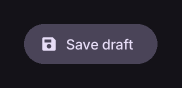

# FilledTonalButton

使用柔和容器色填充的按钮。

[← API 索引](./README.md)

源码：[`saturn/widgets/buttons.py`](../../saturn/widgets/buttons.py)（第 258 行）。

## 效果图



## 示例代码

以下代码可从仓库根目录运行，呈现上图中的控件。

```python
import saturn


def main(page: saturn.Page):
    page.theme_mode = saturn.ThemeMode.DARK
    page.bgcolor = saturn.Colors.SURFACE
    page.padding = 40
    page.add(saturn.FilledTonalButton("Save draft", icon=saturn.Icons.SAVE))
    page.update()


saturn.run(main, backend=saturn.Render.SOFTWARE, width=720, height=360)
```

**基类：** [Button](./Button.md)

## 构造参数

```python
saturn.FilledTonalButton(content=None, *, icon=None, icon_color=None, color=None, bgcolor=None, elevation: 'float' = 1, style=None, on_click=None, on_hover=None, on_long_press=None, on_focus=None, on_blur=None, autofocus=False, url=None, expressive=False, size=None, shape='round', **base)
```

| 参数 | 类型标注 | 默认值 | 作用 |
| --- | --- | --- | --- |
| `content` | `—` | `None` | 要显示的文本或子控件。 |
| `icon` | `—` | `None` | 要绘制的图标。 |
| `icon_color` | `—` | `None` | 图标的前景颜色。 |
| `color` | `—` | `None` | 前景、文字或绘制内容的颜色。 |
| `bgcolor` | `—` | `None` | 控件或容器的背景颜色。 |
| `elevation` | `float` | `1` | 表面高度，对应阴影的视觉强度。 |
| `style` | `—` | `None` | 附加的按钮样式配置。 |
| `on_click` | `—` | `None` | 点击控件时调用的回调。 |
| `on_hover` | `—` | `None` | 指针悬停状态变化时调用的回调。 |
| `on_long_press` | `—` | `None` | 长按控件时调用的回调。 |
| `on_focus` | `—` | `None` | 控件获得焦点时调用的回调。 |
| `on_blur` | `—` | `None` | 控件失去焦点时调用的回调。 |
| `autofocus` | `—` | `False` | 页面打开时是否尝试自动获得焦点。 |
| `url` | `—` | `None` | 点击按钮时打开的目标地址。 |
| `expressive` | `—` | `False` | 是否启用 Expressive 尺寸与形状行为。 |
| `size` | `—` | `None` | 文字、图标或控件的尺寸等级。 |
| `shape` | `—` | `'round'` | 按钮的基础形状。 |
| `**base` | `—` | `额外关键字参数` | 传给基础 Control 构造函数的关键字参数，例如 width、height。 |

`**base` 可传入 [Control 的通用构造参数](./Control.md#构造参数)，例如 `width`、`height`、`visible`。
