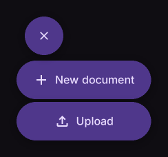

# FloatingActionButtonMenu

从浮动按钮展开多项操作的菜单。

[← API 索引](./README.md)

源码：[`saturn/widgets/floating.py`](../../saturn/widgets/floating.py)（第 248 行）。

## 效果图



## 示例代码

以下代码可从仓库根目录运行，呈现上图中的控件。

```python
import saturn


def main(page: saturn.Page):
    page.theme_mode = saturn.ThemeMode.DARK
    page.bgcolor = saturn.Colors.SURFACE
    page.padding = 40
    page.add(saturn.FloatingActionButtonMenu([saturn.FloatingActionButtonMenuItem("New document", icon=saturn.Icons.ADD), saturn.FloatingActionButtonMenuItem("Upload", icon=saturn.Icons.UPLOAD)], expanded=True))
    page.update()


saturn.run(main, backend=saturn.Render.SOFTWARE, width=720, height=360)
```

**基类：** [Control](./Control.md)

## 本类公开方法

| 方法 | 说明 |
| --- | --- |
| `toggle(self)` | 切换展开与收起状态。 |
| `close(self)` | 关闭窗口或展开的菜单。 |

## 构造参数

```python
saturn.FloatingActionButtonMenu(items=None, *, icon=<Icons.ADD: 57669>, expanded=False, on_select=None, **base)
```

| 参数 | 类型标注 | 默认值 | 作用 |
| --- | --- | --- | --- |
| `items` | `—` | `None` | 传给布局、分组或菜单的项目列表。 |
| `icon` | `—` | `<Icons.ADD: 57669>` | 要绘制的图标。 |
| `expanded` | `—` | `False` | 浮动组件或菜单当前是否展开。 |
| `on_select` | `—` | `None` | 选中菜单项或选项时调用的回调。 |
| `**base` | `—` | `额外关键字参数` | 传给基础 Control 构造函数的关键字参数，例如 width、height。 |

`**base` 可传入 [Control 的通用构造参数](./Control.md#构造参数)，例如 `width`、`height`、`visible`。
