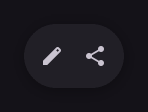

# HorizontalFloatingToolbar

Floating toolbar with horizontally arranged actions.

[← API index](./README.md)

Source: [`saturn/widgets/floating.py`](../../saturn/widgets/floating.py) (line 130).

## Preview



## Example

Run this code from the repository root to display the control shown above.

```python
import saturn


def main(page: saturn.Page):
    page.theme_mode = saturn.ThemeMode.DARK
    page.bgcolor = saturn.Colors.SURFACE
    page.padding = 40
    page.add(saturn.HorizontalFloatingToolbar(saturn.IconButton(saturn.Icons.EDIT), saturn.IconButton(saturn.Icons.SHARE)))
    page.update()


saturn.run(main, backend=saturn.Render.SOFTWARE, width=720, height=360)
```

**Base class:** [FloatingToolbar](./FloatingToolbar.md)

## Constructor parameters

```python
saturn.HorizontalFloatingToolbar(*items, controls=None, leading=None, trailing=None, expanded=True, vertical=False, vibrant=False, bgcolor=None, elevation=6, **base)
```

| Parameter | Type annotation | Default | Description |
| --- | --- | --- | --- |
| `*items` | `—` | `additional positional arguments` | Items passed to a layout, group, or menu. |
| `controls` | `—` | `None` | Child controls in display order. |
| `leading` | `—` | `None` | Control or area before the main content. |
| `trailing` | `—` | `None` | Control or area after the main content. |
| `expanded` | `—` | `True` | Whether the floating component or menu is expanded. |
| `vertical` | `—` | `False` | Use vertical layout when True. |
| `vibrant` | `—` | `False` | Use a more vivid surface color for the toolbar. |
| `bgcolor` | `—` | `None` | Background color of the control or container. |
| `elevation` | `—` | `6` | Surface elevation, which determines shadow strength. |
| `**base` | `—` | `additional keyword arguments` | Keyword arguments passed to Control, such as width and height. |

`**base` accepts [common Control constructor parameters](./Control.md#constructor-parameters), such as `width`, `height`, and `visible`.
