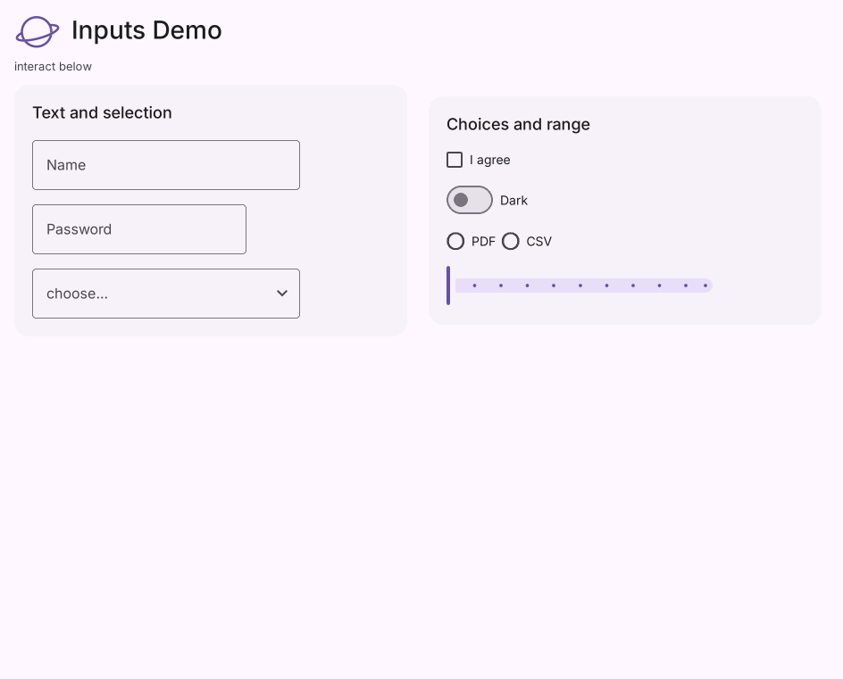

# Slider

Saturn 的 Slider 公开 API。

[← API 索引](./README.md)

源码：[`saturn/widgets/inputs.py`](../../saturn/widgets/inputs.py)（第 1216 行）。

**基类：** [Control](./Control.md)

## 构造

```python
ft.Slider(value=None, *, min: 'float' = 0.0, max: 'float' = 1.0, divisions: 'int | None' = None, label=None, round: 'int' = 0, active_color=None, inactive_color=None, thumb_color=None, on_change=None, on_change_start=None, on_change_end=None, **base)
```

### 参数

| 参数 | 类型标注 | 默认值 |
| --- | --- | --- |
| `value` | `—` | `None` |
| `min` | `float` | `0.0` |
| `max` | `float` | `1.0` |
| `divisions` | `int | None` | `None` |
| `label` | `—` | `None` |
| `round` | `int` | `0` |
| `active_color` | `—` | `None` |
| `inactive_color` | `—` | `None` |
| `thumb_color` | `—` | `None` |
| `on_change` | `—` | `None` |
| `on_change_start` | `—` | `None` |
| `on_change_end` | `—` | `None` |
| `base` | `—` | `额外关键字参数` |

## 本类属性

`active_color`、`divisions`、`inactive_color`、`label`、`max`、`min`、`round`、`thumb_color`、`value`。

## 事件回调

`on_change`、`on_change_end`、`on_change_start`。

## 效果预览



---

本页依据仓库当前公开 API 与源码生成。继承成员请查阅基类；参数表中的 `**base` 会传给基类。
