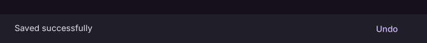

# SnackBar

Displays brief feedback about an action.

[← API index](./README.md)

Source: [`saturn/widgets/dialogs.py`](../../saturn/widgets/dialogs.py) (line 227).

## Preview



## Example

Run this code from the repository root to display the control shown above.

```python
import saturn


def main(page: saturn.Page):
    page.theme_mode = saturn.ThemeMode.DARK
    page.bgcolor = saturn.Colors.SURFACE
    page.padding = 40
    page.show_dialog(saturn.SnackBar(saturn.Text("Saved successfully", color=saturn.Colors.ON_SURFACE), action="Undo", bgcolor=saturn.Colors.SURFACE_CONTAINER, duration=10000))
    page.update()


saturn.run(main, backend=saturn.Render.SOFTWARE, width=720, height=360)
```

**Base class:** `DialogControl`

## Constructor parameters

```python
saturn.SnackBar(content, *, action=None, bgcolor=None, duration: 'int' = 4000, on_action=None, open=False, on_dismiss=None, **base)
```

| Parameter | Type annotation | Default | Description |
| --- | --- | --- | --- |
| `content` | `—` | `required` | Text or child control to display. |
| `action` | `—` | `None` | Single action label or button on a snackbar. |
| `bgcolor` | `—` | `None` | Background color of the control or container. |
| `duration` | `int` | `4000` | How many milliseconds the snackbar remains visible. |
| `on_action` | `—` | `None` | Callback called when the snackbar action is clicked. |
| `open` | `—` | `False` | Whether the dialog or snackbar is open. |
| `on_dismiss` | `—` | `None` | Callback called when the dialog or snackbar closes. |
| `**base` | `—` | `additional keyword arguments` | Keyword arguments passed to Control, such as width and height. |

`**base` accepts [common Control constructor parameters](./Control.md#constructor-parameters), such as `width`, `height`, and `visible`.
