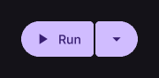

# SplitButton

Button with separate primary and secondary actions.

[← API index](./README.md)

Source: [`saturn/widgets/split_button.py`](../../saturn/widgets/split_button.py) (line 106).

## Preview



## Example

Run this code from the repository root to display the control shown above.

```python
import saturn


def main(page: saturn.Page):
    page.theme_mode = saturn.ThemeMode.DARK
    page.bgcolor = saturn.Colors.SURFACE
    page.padding = 40
    page.add(saturn.SplitButton("Run", icon=saturn.Icons.PLAY_ARROW))
    page.update()


saturn.run(main, backend=saturn.Render.SOFTWARE, width=720, height=360)
```

**Base class:** [Control](./Control.md)

## Constructor parameters

```python
saturn.SplitButton(content: 'str' = '', *, icon=None, trailing_icon=<Icons.ARROW_DROP_DOWN: 58821>, on_click=None, on_trailing_click=None, bgcolor=None, color=None, **base)
```

| Parameter | Type annotation | Default | Description |
| --- | --- | --- | --- |
| `content` | `str` | `''` | Text or child control to display. |
| `icon` | `—` | `None` | Icon to draw. |
| `trailing_icon` | `—` | `<Icons.ARROW_DROP_DOWN: 58821>` | Icon in the secondary action area of a split button. |
| `on_click` | `—` | `None` | Callback called when the control is clicked. |
| `on_trailing_click` | `—` | `None` | Callback called when the split button's secondary action is clicked. |
| `bgcolor` | `—` | `None` | Background color of the control or container. |
| `color` | `—` | `None` | Color of foreground content, text, or drawing. |
| `**base` | `—` | `additional keyword arguments` | Keyword arguments passed to Control, such as width and height. |

`**base` accepts [common Control constructor parameters](./Control.md#constructor-parameters), such as `width`, `height`, and `visible`.
