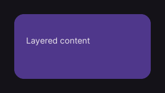

# Stack

Places child controls in overlapping layers.

[← API index](./README.md)

Source: [`saturn/widgets/containers.py`](../../saturn/widgets/containers.py) (line 347).

## Preview



## Example

Run this code from the repository root to display the control shown above.

```python
import saturn


def main(page: saturn.Page):
    page.theme_mode = saturn.ThemeMode.DARK
    page.bgcolor = saturn.Colors.SURFACE
    page.padding = 40
    page.add(saturn.Stack([saturn.Container(width=230, height=110, bgcolor=saturn.Colors.PRIMARY_CONTAINER, border_radius=16), saturn.Text("Layered content", left=20, top=36)], width=230, height=110))
    page.update()


saturn.run(main, backend=saturn.Render.SOFTWARE, width=720, height=360)
```

**Base class:** [Control](./Control.md)

## Constructor parameters

```python
saturn.Stack(*items, controls=None, **base)
```

| Parameter | Type annotation | Default | Description |
| --- | --- | --- | --- |
| `*items` | `—` | `additional positional arguments` | Items passed to a layout, group, or menu. |
| `controls` | `—` | `None` | Child controls in display order. |
| `**base` | `—` | `additional keyword arguments` | Keyword arguments passed to Control, such as width and height. |

`**base` accepts [common Control constructor parameters](./Control.md#constructor-parameters), such as `width`, `height`, and `visible`.
