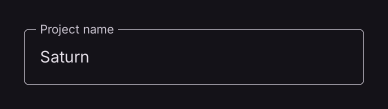

# TextField

Editable text input field.

[← API index](./README.md)

Source: [`saturn/widgets/inputs.py`](../../saturn/widgets/inputs.py) (line 76).

## Preview



## Example

Run this code from the repository root to display the control shown above.

```python
import saturn


def main(page: saturn.Page):
    page.theme_mode = saturn.ThemeMode.DARK
    page.bgcolor = saturn.Colors.SURFACE
    page.padding = 40
    page.add(saturn.TextField("Saturn", label="Project name", width=340))
    page.update()


saturn.run(main, backend=saturn.Render.SOFTWARE, width=720, height=360)
```

**Base class:** [Control](./Control.md)

## Constructor parameters

```python
saturn.TextField(value: 'str' = '', *, label=None, hint_text=None, password: 'bool' = False, multiline: 'bool' = False, max_lines: 'int | None' = None, read_only: 'bool' = False, text_size: 'float | None' = None, on_change=None, on_submit=None, on_focus=None, on_blur=None, on_click=None, filled: 'bool' = False, bgcolor=None, border_color=None, cursor_color=None, border_radius: 'float | None' = None, border=None, text_style=None, can_reveal_password: 'bool' = False, on_hover=None, **base)
```

| Parameter | Type annotation | Default | Description |
| --- | --- | --- | --- |
| `value` | `str` | `''` | Initial or current text field content. |
| `label` | `—` | `None` | Label beside an input, option, or control. |
| `hint_text` | `—` | `None` | Hint shown before a value is entered or selected. |
| `password` | `bool` | `False` | Mask entered characters when True. |
| `multiline` | `bool` | `False` | Allow multiple lines of text input. |
| `max_lines` | `int | None` | `None` | Maximum number of lines to show or accept. |
| `read_only` | `bool` | `False` | Display content without allowing edits when True. |
| `text_size` | `float | None` | `None` | Font size of entered or selected text. |
| `on_change` | `—` | `None` | Callback called when the value changes. |
| `on_submit` | `—` | `None` | Callback called when input is submitted. |
| `on_focus` | `—` | `None` | Callback called when the control gains focus. |
| `on_blur` | `—` | `None` | Callback called when the control loses focus. |
| `on_click` | `—` | `None` | Callback called when the control is clicked. |
| `filled` | `bool` | `False` | Use a filled input area. |
| `bgcolor` | `—` | `None` | Background color of the control or container. |
| `border_color` | `—` | `None` | Border color of the input area. |
| `cursor_color` | `—` | `None` | Color of the text insertion cursor. |
| `border_radius` | `float | None` | `None` | Corner radius of the border or background. |
| `border` | `—` | `None` | Border settings. |
| `text_style` | `—` | `None` | Style of entered or displayed text. |
| `can_reveal_password` | `bool` | `False` | Show a button for toggling password visibility. |
| `on_hover` | `—` | `None` | Callback called when the pointer's hover state changes. |
| `**base` | `—` | `additional keyword arguments` | Keyword arguments passed to Control, such as width and height. |

`**base` accepts [common Control constructor parameters](./Control.md#constructor-parameters), such as `width`, `height`, and `visible`.
