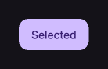

# ToggleButton

Button that switches between selected and unselected states.

[← API index](./README.md)

Source: [`saturn/widgets/toggle_button.py`](../../saturn/widgets/toggle_button.py) (line 15).

## Preview



## Example

Run this code from the repository root to display the control shown above.

```python
import saturn


def main(page: saturn.Page):
    page.theme_mode = saturn.ThemeMode.DARK
    page.bgcolor = saturn.Colors.SURFACE
    page.padding = 40
    page.add(saturn.ToggleButton("Selected", checked=True))
    page.update()


saturn.run(main, backend=saturn.Render.SOFTWARE, width=720, height=360)
```

**Base class:** [ExpressiveButton](./ExpressiveButton.md)

## Constructor parameters

```python
saturn.ToggleButton(content=None, *, checked=False, on_change=None, variant='filled', size='small', **kwargs)
```

| Parameter | Type annotation | Default | Description |
| --- | --- | --- | --- |
| `content` | `—` | `None` | Text or child control to display. |
| `checked` | `—` | `False` | Whether the toggle button is currently selected. |
| `on_change` | `—` | `None` | Callback called when the value changes. |
| `variant` | `—` | `'filled'` | Visual variant of this control. |
| `size` | `—` | `'small'` | Size of the text, icon, or control. |
| `**kwargs` | `—` | `additional keyword arguments` | Keyword arguments passed to the parent constructor. |
