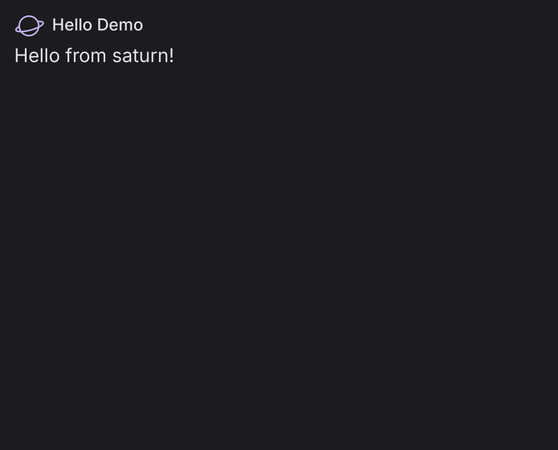
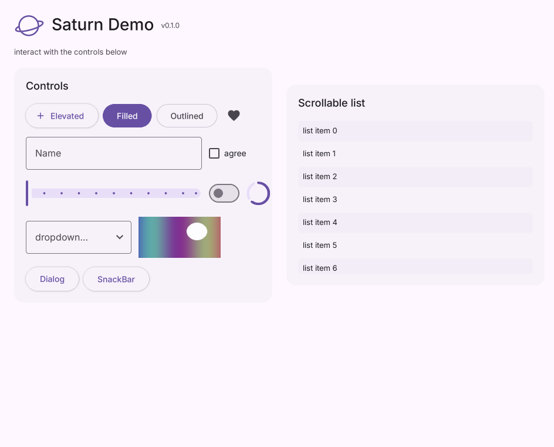
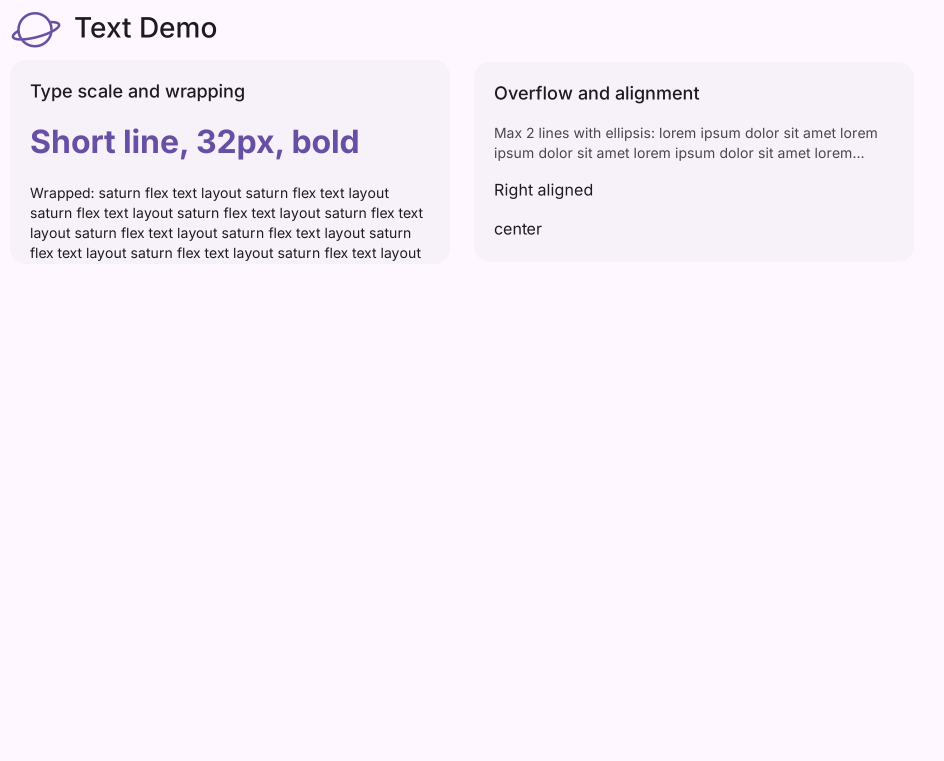
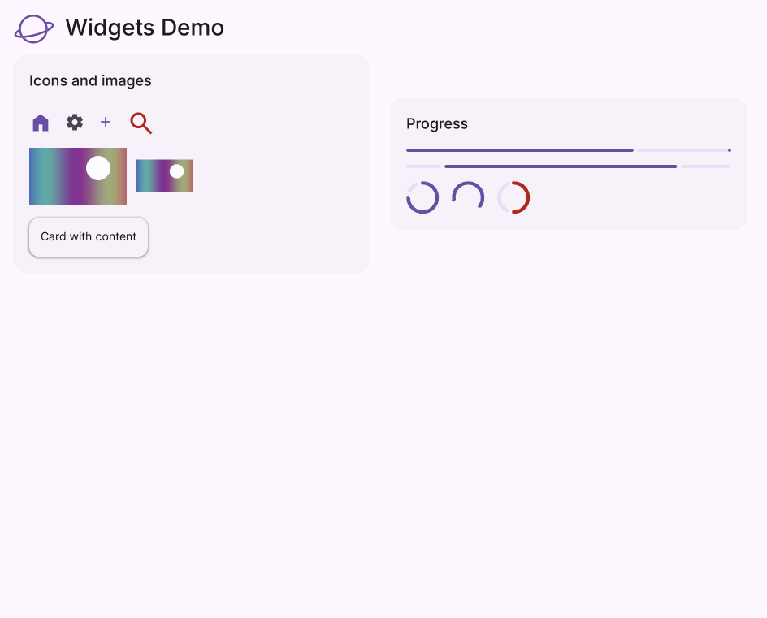
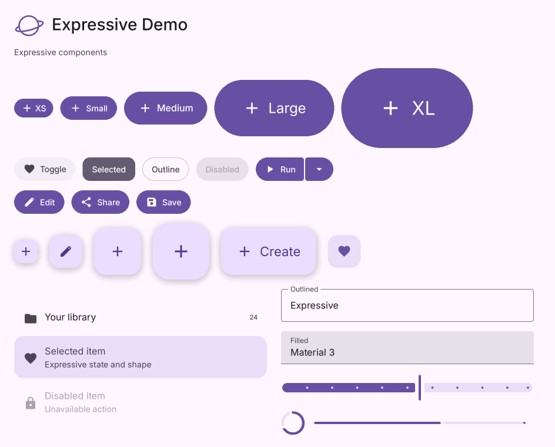
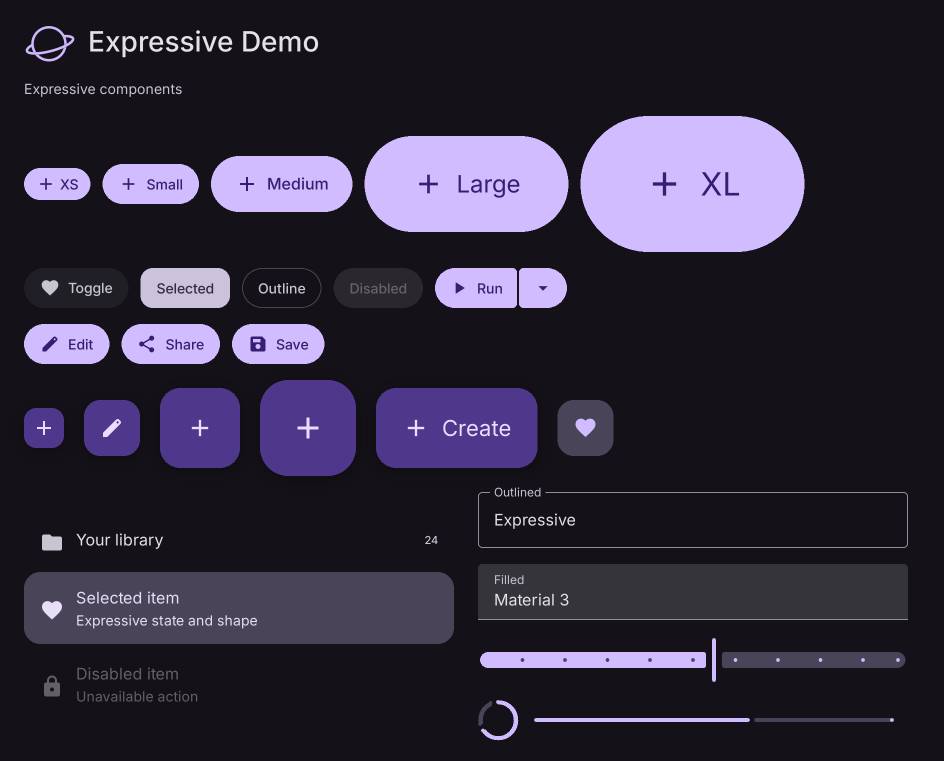
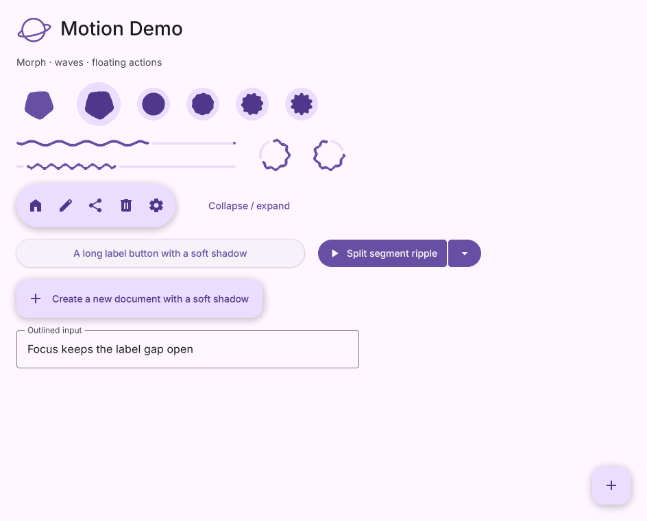
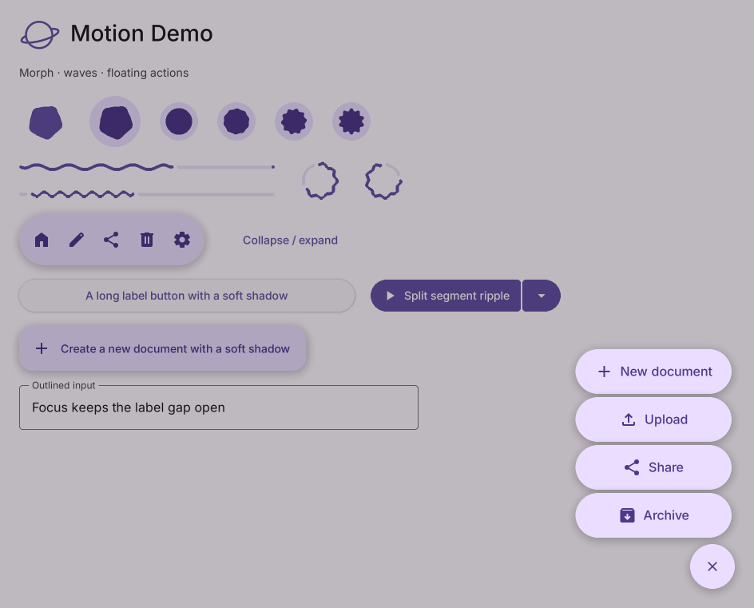

# 截图画廊

[← 文档首页](./README.md) · [API 索引](./api/README.md)

以下图片来自仓库中的 Saturn 示例。点击对应示例源码，可在本机运行并观察交互效果。

所有示例窗口统一为 960 × 800；每个标题前使用透明背景的经典 Saturn 标志，颜色随主题变化。

## 基础组件

### Hello

[运行 `examples/hello.py`](../examples/hello.py) · [五分钟上手](./getting-started.md)

### 综合示例

[运行 `examples/demo.py`](../examples/demo.py) · [Page](./api/Page.md) · [ListView](./api/ListView.md)

### 布局与文本

[布局示例](../examples/layout_demo.py) · [Row](./api/Row.md) · [Column](./api/Column.md) · [Stack](./api/Stack.md)

[文本示例](../examples/text_demo.py) · [Text](./api/Text.md) · [TextStyle](./api/TextStyle.md)

### 按钮、输入和内容

[按钮示例](../examples/buttons_demo.py) · [Button](./api/Button.md) · [FilledButton](./api/FilledButton.md)

[输入示例](../examples/inputs_demo.py) · [TextField](./api/TextField.md) · [Dropdown](./api/Dropdown.md)

[内容示例](../examples/widgets_demo.py) · [Image](./api/Image.md) · [Card](./api/Card.md)

## Material Expressive

[Expressive 示例](../examples/expressive_demo.py) · [ExpressiveButton](./api/ExpressiveButton.md) · [MaterialExpressiveTheme](./api/MaterialExpressiveTheme.md)

| 浅色 | 深色 |
| --- | --- |
|  |  |

### 动态与浮动菜单

[动态示例](../examples/expressive_motion_demo.py) · [LoadingIndicator](./api/LoadingIndicator.md) · [FloatingActionButtonMenu](./api/FloatingActionButtonMenu.md)

| 动态组件 | 菜单展开 |
| --- | --- |
|  |  |

截图记录了示例的一帧。动效、悬停、点击和输入行为请运行对应示例查看。
